# Test práctico: Ciclo de desarrollo de un producto usando el marco de trabajo de Scrum

Este test se enfoca en evaluar el conocimiento sobre el ciclo de desarrollo de un producto utilizando el marco de trabajo de Scrum. A continuación, se presentan un caso de uso que debe desarrollarse durante en tiempo de clase.

## Consideraciones generales

- Debe asumir que cada hora corresponde a un día de trabajo.
- El equipo de desarrollo está compuesto por 2 personas.
- Se debe cubrir todo el ciclo del proyecto.
- El proyecto debe ser entregado al final de la clase.
- Todos los artefacto debe ser desarrollados en este mismo documento.
- Se debe justificar cada decisión tomada durante el desarrollo del proyecto.
- Se debe demostrar suficiencia en el uso de ingeniería de software, desarrollo de software, y Scrum.
- El proyecto debe ser desarrollado utilizando el marco de trabajo de Scrum, incluyendo sus artefactos y eventos.
- Se debe desarrollar el producto en la tecnología de su experticia y adecuada para el caso de práctico presentado.
- Cada estudiante debe comprometer un único caso de uso del producto, pero ambos deben colaborar en todas las etapas del desarrollo.

## Caso de práctico

La tienda 'PixelPets', necesita que sus clientes tengan una vitrina digital atractiva y funcional. Actualmente, los usuarios se sienten abrumados si ven todas las mascotas en una sola lista desordenada.Queremos que los clientes puedan buscar a su futura mascota por su nombre si ya lo conocen, pero también que puedan filtrar por su especie o qué tan raras son, porque los coleccionistas buscan cosas específicas. Además, es vital que puedan ordenar la lista por precio, ya sea para ver las más baratas primero o las más exclusivas. La idea es que la aplicación sea fluida para que el cliente y pueda encontrar su mascota ideal.

### Información de la mascota

1. ID (Identificador único)
2. Nombre (Alias de la mascota)
3. Especie (Ej: Dragón, Gato Cósmico, Robot)
4. Nivel de Rareza (Ej: Común, Raro, Legendario)
5. Precio (En monedas virtuales)
6. Estado de Salud (Porcentaje 0-100%)

## Solución

Desarrolle el producto siguiendo el marco de trabajo de Scrum teniendo en cuenta las consideraciones generales. Asegúrese de cubrir todas las etapas del ciclo de desarrollo, desde la planificación hasta la entrega final del producto. Justifique cada decisión tomada durante el proceso y asegúrese de que el producto final cumpla con los requisitos establecidos en el caso de práctico.

## Regimen de evaluación

- 50% Proceso de desarrollo: Se evaluará la aplicación correcta del marco de trabajo de Scrum, incluyendo la planificación, ejecución y revisión del proyecto.
- 30% Producto final: Se evaluará la funcionalidad, usabilidad y cumplimiento de los requisitos establecidos en el caso de práctico.
- 20% Justificación de decisiones: Se evaluará la calidad de las justificaciones proporcionadas para cada decisión tomada durante el desarrollo del proyecto, demostrando con estadística y una base sólida de la ingeniería de software, desarrollo de software y Scrum.

## Uso de Markdown

Para documentar el proceso de desarrollo, se recomienda utilizar Markdown para estructurar el contenido de manera clara y legible. A continuación, se proporcionan algunos recursos útiles para aprender y aplicar Markdown:

[Guía de estilo de Markdown en MDN](https://developer.mozilla.org/es/docs/MDN/Writing_guidelines/Howto/Markdown_in_MDN)

### Cómo incluir código en Markdown

Para incluir código en Markdown, puedes usar las siguientes sintaxis:

```python
# Código en bloque para fragmentos más largos
def ejemplo():
    print("Hola, mundo!")
```

### Cómo incluir enlaces en Markdown

Para incluir enlaces en Markdown, puedes usar la siguiente sintaxis:

```markdown
[Texto del enlace](URL)
```

### Cómo incluir imágenes en Markdown

```markdown

```

### Cómo incluir listas en Markdown

```markdown-
- Otro elemento de lista
```

### Cómo incluir tablas en Markdown

```markdown
| Encabezado 1 | Encabezado 2 |
| ------------ | ------------ |
| Celda 1      | Celda 2      |
| Celda 3      | Celda 4      |
```

### Cómo incluir citas en Markdown

```markdown
> Esta es una cita en Markdown.
```

### Cómo incluir negritas y cursivas en Markdown

```markdown
**Texto en negrita**

_Texto en cursiva_
```

### Cómo incluir encabezados en Markdown

```markdown
# Encabezado de nivel 1

## Encabezado de nivel 2

### Encabezado de nivel 3
```

---

# PixelPets — Documentación del ciclo de desarrollo con Scrum

> La siguiente documentación reconstruye de manera académica y coherente un ciclo Scrum simulado de 12 días, tomando como evidencia el incremento funcional desarrollado, el Product Backlog, el Sprint Backlog y los resultados técnicos reales del proyecto PixelPets.

## Identificación del proyecto

| Elemento              | Descripción                                                               |
| --------------------- | -------------------------------------------------------------------------- |
| Proyecto              | PixelPets                                                                  |
| Tipo de producto      | Aplicación web  para consultar una vitrina digital de mascotas virtuales |
| Modalidad             | Ejercicio académico con un ciclo Scrum simulado                           |
| Integrantes           | David Ricardo Carvajal Barragán y Juan Pablo Arenas Avendaño             |
| Cantidad de Sprints   | 1                                                                          |
| Duración             | 12 días simulados                                                         |
| Relación académica  | Una hora de clase equivale a un día simulado de trabajo                   |
| Release planificada   | MVP v1.0                                                                   |
| Estado del incremento | Funcional y disponible localmente                                          |

## Resumen ejecutivo

PixelPets responde al problema de presentar una colección de mascotas virtuales sin abrumar al usuario. El incremento desarrollado ofrece una vitrina digital que consulta 18 mascotas desde una API REST y permite buscar por nombre, filtrar por especie y rareza, ordenar por precio y restablecer los controles. Cada tarjeta conserva los seis datos exigidos por el caso: identificador, nombre, especie, rareza, precio y salud.

La solución utiliza un monorepo con React y TypeScript en el frontend, y Node.js, Express, TypeScript y Zod en el backend. El catálogo existe únicamente en el servidor; el cliente obtiene tanto los resultados como las opciones de filtrado mediante rutas relativas `/api`. Esta separación permite demostrar una integración full stack real sin incorporar una base de datos que el alcance no requiere.

Para representar el ciclo de trabajo se definieron ocho historias, descompuestas en 24 tareas. El Sprint planificó y completó 40 puntos, con una distribución equilibrada de 20 puntos por integrante. El seguimiento temporal registró 120 horas simuladas. La calidad del incremento se respaldó con TypeScript estricto, ESLint, build de producción y 38 pruebas automatizadas aprobadas.

## Comprensión del problema

La lista inicial planteada por la tienda podía generar sobrecarga al no ofrecer mecanismos para reducir u ordenar los resultados. El usuario puede conocer de antemano el alias de una mascota o, en cambio, explorar según atributos de colección. Por ello se identificaron cuatro capacidades principales:

1. Consultar el catálogo completo.
2. Buscar una mascota por nombre.
3. Filtrar por especie y rareza.
4. Ordenar numéricamente por precio.

Estas capacidades debían combinarse sin recargar la página y sin ocultar la información esencial de cada criatura. El valor del producto no está en aumentar el número de operaciones, sino en reducir el esfuerzo necesario para localizar una alternativa adecuada. El Product Backlog convirtió este problema en trabajo ordenado y verificable, mientras que el Sprint Backlog hizo visible su ejecución [1].

## Alcance

### Funcionalidades incluidas

El incremento implementa:

1. Consulta de las 18 mascotas.
2. Búsqueda por nombre.
3. Coincidencias parciales.
4. Comparación sin distinguir mayúsculas y minúsculas.
5. Normalización de tildes.
6. Eliminación de espacios externos.
7. Filtro por especie.
8. Filtro por rareza.
9. Combinación de filtros.
10. Combinación de búsqueda y filtros.
11. Orden ascendente por precio.
12. Orden descendente por precio.
13. Restablecimiento del catálogo.
14. Conteo de resultados.
15. Estado de carga.
16. Estado de error.
17. Reintento de la consulta.
18. Estado sin coincidencias.
19. Limpieza de filtros desde el estado vacío.
20. Navegación mediante teclado.
21. Foco visible.
22. Respeto por la preferencia de reducción de movimiento.
23. Adaptación a celular, tableta y computador.
24. Consulta de opciones de filtros desde el backend.

### Fuera del alcance

No se implementaron autenticación, registro, roles, CRUD de mascotas, base de datos, compras, pagos, carrito, favoritos persistentes, panel administrativo, servicios externos, WebSockets, microservicios ni despliegue.

Esta delimitación responde al caso práctico: PixelPets requiere una vitrina de consulta, búsqueda, filtrado y ordenamiento, no un sistema transaccional. Evitar funcionalidades ajenas permitió concentrar las 120 horas simuladas en usabilidad, accesibilidad, integración y pruebas.

## Visión y Objetivo del Producto

La visión consiste en ofrecer una colección digital comprensible y agradable, en la que explorar muchas criaturas no implique recorrer manualmente una lista desordenada.

> **Objetivo del Producto:** construir una vitrina digital atractiva, fluida, accesible y funcional para que los usuarios puedan consultar mascotas virtuales, buscar por nombre, filtrar por especie y rareza y ordenar los resultados por precio, visualizando siempre la información esencial de cada mascota.

De acuerdo con Scrum, el Objetivo del Producto es el compromiso asociado al Product Backlog; el Objetivo del Sprint corresponde al Sprint Backlog y la Definición de Terminado al Incremento [1]. Esta relación mantuvo alineados el valor esperado, el plan de trabajo y el estándar de calidad.

## Equipo Scrum y responsabilidades

| Integrante                       | Responsabilidad principal | Participación adicional |
| -------------------------------- | ------------------------- | ------------------------ |
| David Ricardo Carvajal Barragán | Scrum Master              | Desarrollador            |
| Juan Pablo Arenas Avendaño      | Product Owner             | Desarrollador            |

El ejercicio limita el equipo a dos personas. Por esta razón, ambos participaron como desarrolladores y asumieron adicionalmente una responsabilidad principal de Scrum. David facilitó la comprensión del marco de trabajo, el seguimiento y la eliminación de impedimentos moderados. Juan Pablo ordenó el trabajo según el valor del caso y verificó la claridad del Product Backlog.

Esta combinación es una adaptación académica y no se presenta como la composición ideal de un equipo grande. En Scrum las responsabilidades de Product Owner, Scrum Master y Developers tienen propósitos distintos [1]; aquí se conservaron transparentes, aunque una misma persona debiera ejecutar más de una función por la restricción de dos integrantes.

## Casos de uso comprometidos

| Integrante                       | Caso de uso comprometido              |
| -------------------------------- | ------------------------------------- |
| David Ricardo Carvajal Barragán | Buscar mascotas por nombre            |
| Juan Pablo Arenas Avendaño      | Filtrar mascotas por especie y rareza |

Ambos colaboraron en arquitectura, integración, pruebas, interfaz, documentación y validación. El ordenamiento por precio y las tareas transversales formaron parte del incremento compartido. La asignación del Excel indica liderazgo o responsabilidad de ejecución, pero no representa trabajo aislado.

## Adaptación académica de Scrum

El ciclo se modeló como un Sprint único de 12 días simulados. Cada hora de clase se interpretó como un día de trabajo, conforme al enunciado. Las horas registradas representan esfuerzo simulado distribuido entre actividades técnicas; no deben confundirse con puntos, que expresan tamaño relativo.

| Evento o actividad   | Propósito                                    | Participantes                               | Resultado                                 |
| -------------------- | --------------------------------------------- | ------------------------------------------- | ----------------------------------------- |
| Sprint Planning      | Definir por qué, qué y cómo se trabajaría | Ambos integrantes                           | Objetivo del Sprint, ocho HU y 24 tareas  |
| Daily Scrum          | Inspeccionar avance y adaptar el plan         | Ambos desarrolladores                       | Seguimiento de 12 días                   |
| Refinamiento         | Aclarar y descomponer trabajo                 | Ambos integrantes                           | Historias entendibles y tareas estimables |
| Sprint Review        | Inspeccionar el Incremento                    | Ambos integrantes en simulación académica | Aceptación de 40 puntos                  |
| Sprint Retrospective | Identificar mejoras                           | Ambos integrantes                           | Acciones de mejora                        |

El refinamiento se trató como actividad continua y no como uno de los eventos formales de Scrum. Las Daily Scrum, la Sprint Review y la Sprint Retrospective se documentan como simulaciones académicas internas, no como reuniones históricas con un cliente externo.

## Product Backlog

El Product Backlog se originó al transformar el caso práctico en resultados funcionales y técnicos. Primero se priorizaron arquitectura y API porque habilitaban el resto; después se ordenaron búsqueda, filtros, ordenamiento e interfaz. La calidad y la accesibilidad recibieron estimaciones mayores porque atraviesan varias capas y requieren más escenarios de verificación.

Se utilizó la escala Fibonacci para expresar incertidumbre y esfuerzo relativo sin presentar los puntos como horas. Los 40 puntos se repartieron entre ocho historias y luego se descompusieron en 24 tareas. La suma válida del compromiso se obtiene de las historias o, de manera equivalente, de sus tareas; no se suman ambos niveles porque las tareas desglosan el valor de su historia.

| HU-ID | TASK-ID  | HU/TASK                                                                             | ASIGNADO A                       | PRIORIDAD | ESTADO | PUNTOS US | SPRINT | RELEASE  |
| ----- | -------- | ----------------------------------------------------------------------------------- | -------------------------------- | --------- | ------ | --------: | -----: | -------- |
| HU-01 |          | Configurar arquitectura full stack y entorno de trabajo                             | David Ricardo Carvajal Barragán | Alta      | Done   |         3 |      1 | MVP v1.0 |
|       | HU-01.01 | Estructurar el monorepo con cliente React y servidor Express                        | David Ricardo Carvajal Barragán | Alta      | Done   |         1 |      1 | MVP v1.0 |
|       | HU-01.02 | Configurar TypeScript estricto, Vite, Tailwind y ESLint en ambos proyectos          | Juan Pablo Arenas Avendaño      | Alta      | Done   |         1 |      1 | MVP v1.0 |
|       | HU-01.03 | Definir scripts raíz para desarrollo, pruebas, build y ejecución de producción   | David Ricardo Carvajal Barragán | Alta      | Done   |         1 |      1 | MVP v1.0 |
| HU-02 |          | Exponer el catálogo tipado de PixelPets mediante una API REST                      | Juan Pablo Arenas Avendaño      | Alta      | Done   |         5 |      1 | MVP v1.0 |
|       | HU-02.01 | Definir tipos de dominio y crear el catálogo local validado de 18 mascotas         | Juan Pablo Arenas Avendaño      | Alta      | Done   |         2 |      1 | MVP v1.0 |
|       | HU-02.02 | Implementar servicio de catálogo sin mutar los datos originales                    | David Ricardo Carvajal Barragán | Alta      | Done   |         2 |      1 | MVP v1.0 |
|       | HU-02.03 | Crear endpoints de salud, consulta y opciones con respuestas consistentes           | Juan Pablo Arenas Avendaño      | Alta      | Done   |         1 |      1 | MVP v1.0 |
| HU-03 |          | Buscar mascotas por nombre de forma tolerante                                       | David Ricardo Carvajal Barragán | Alta      | Done   |         5 |      1 | MVP v1.0 |
|       | HU-03.01 | Validar parámetros y normalizar búsquedas sin distinguir mayúsculas ni tildes    | David Ricardo Carvajal Barragán | Alta      | Done   |         2 |      1 | MVP v1.0 |
|       | HU-03.02 | Consumir la API con debounce de 300 ms y cancelación de solicitudes obsoletas      | Juan Pablo Arenas Avendaño      | Alta      | Done   |         2 |      1 | MVP v1.0 |
|       | HU-03.03 | Verificar búsquedas exactas, parciales, vacías y con espacios externos            | David Ricardo Carvajal Barragán | Alta      | Done   |         1 |      1 | MVP v1.0 |
| HU-04 |          | Filtrar mascotas por especie y rareza                                               | Juan Pablo Arenas Avendaño      | Alta      | Done   |         5 |      1 | MVP v1.0 |
|       | HU-04.01 | Construir selectores dinámicos con opciones obtenidas desde el backend             | Juan Pablo Arenas Avendaño      | Alta      | Done   |         2 |      1 | MVP v1.0 |
|       | HU-04.02 | Aplicar filtros combinables de especie y rareza junto con la búsqueda              | David Ricardo Carvajal Barragán | Alta      | Done   |         2 |      1 | MVP v1.0 |
|       | HU-04.03 | Implementar limpieza de filtros y estado vacío con acción de recuperación        | Juan Pablo Arenas Avendaño      | Alta      | Done   |         1 |      1 | MVP v1.0 |
| HU-05 |          | Ordenar por precio y restablecer el catálogo                                       | David Ricardo Carvajal Barragán | Media     | Done   |         3 |      1 | MVP v1.0 |
|       | HU-05.01 | Implementar ordenamiento estable por precio ascendente y descendente                | David Ricardo Carvajal Barragán | Media     | Done   |         1 |      1 | MVP v1.0 |
|       | HU-05.02 | Agregar selector de orden, contador de resultados y botón Limpiar                  | Juan Pablo Arenas Avendaño      | Media     | Done   |         1 |      1 | MVP v1.0 |
|       | HU-05.03 | Probar búsqueda, filtros y ordenamiento funcionando conjuntamente                  | David Ricardo Carvajal Barragán | Media     | Done   |         1 |      1 | MVP v1.0 |
| HU-06 |          | Consultar el catálogo en una interfaz responsive y accesible                       | Juan Pablo Arenas Avendaño      | Alta      | Done   |         8 |      1 | MVP v1.0 |
|       | HU-06.01 | Diseñar encabezado, panel de filtros, tarjetas y cuadrícula responsive            | Juan Pablo Arenas Avendaño      | Alta      | Done   |         3 |      1 | MVP v1.0 |
|       | HU-06.02 | Incorporar navegación por teclado, foco visible y movimiento reducido              | David Ricardo Carvajal Barragán | Alta      | Done   |         3 |      1 | MVP v1.0 |
|       | HU-06.03 | Implementar estados de carga, error, reintento y resultados vacíos                 | Juan Pablo Arenas Avendaño      | Alta      | Done   |         2 |      1 | MVP v1.0 |
| HU-07 |          | Verificar la calidad técnica y la ejecución en producción                        | David Ricardo Carvajal Barragán | Alta      | Done   |         8 |      1 | MVP v1.0 |
|       | HU-07.01 | Crear pruebas backend para catálogo, servicio, validación y endpoints             | David Ricardo Carvajal Barragán | Alta      | Done   |         3 |      1 | MVP v1.0 |
|       | HU-07.02 | Crear pruebas frontend para renderizado, controles, errores y reintento             | Juan Pablo Arenas Avendaño      | Alta      | Done   |         3 |      1 | MVP v1.0 |
|       | HU-07.03 | Ejecutar typecheck, lint, pruebas, build, audit y comprobación de producción      | David Ricardo Carvajal Barragán | Alta      | Done   |         2 |      1 | MVP v1.0 |
| HU-08 |          | Documentar y validar la entrega del incremento                                      | Juan Pablo Arenas Avendaño      | Media     | Done   |         3 |      1 | MVP v1.0 |
|       | HU-08.01 | Actualizar README con arquitectura, comandos, endpoints y alcance real              | Juan Pablo Arenas Avendaño      | Media     | Done   |         1 |      1 | MVP v1.0 |
|       | HU-08.02 | Confirmar integridad del enunciado y revisar el estado final de Git                 | David Ricardo Carvajal Barragán | Media     | Done   |         1 |      1 | MVP v1.0 |
|       | HU-08.03 | Realizar revisión visual de escritorio y registrar la validación móvil pendiente | Juan Pablo Arenas Avendaño      | Media     | Done   |         1 |      1 | MVP v1.0 |

> **EVIDENCIA PB-01 — Product Backlog completo**
>
> 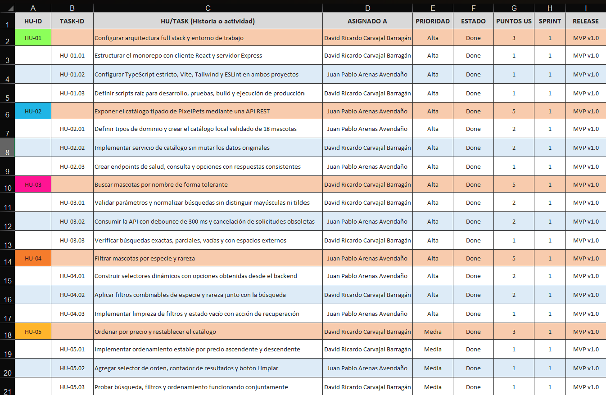
>
> 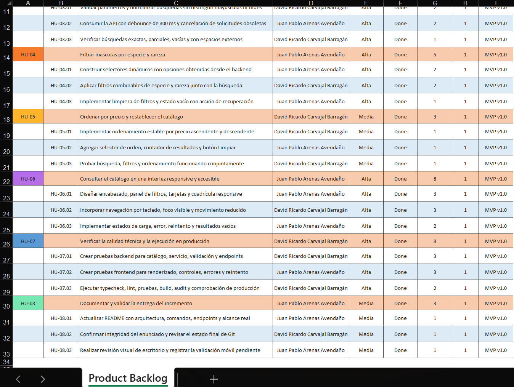
>
> Figura 1 y 2. Product Backlog de PixelPets con las historias y tareas priorizadas para el MVP v1.0.
> Fuente: elaboración propia.

### Aclaración sobre la gráfica del Product Backlog

`Product_Backlog_PixelPets.xlsx` contiene la tabla anterior, pero no contiene una gráfica. Por ello no se presenta ni se deja un espacio para una gráfica inexistente. Los dos gráficos de seguimiento son Burn Down y se encuentran en las hojas del Sprint Backlog.

## Historias de usuario y criterios de aceptación

HU-01, HU-02, HU-07 y HU-08 son historias técnicas o habilitadoras: no representan por sí solas un control visible para el usuario, pero permiten construir, integrar, verificar y entregar el producto.

### HU-01 — Configurar arquitectura full stack y entorno de trabajo

- **Redacción:** como equipo de desarrollo, queremos configurar una arquitectura full stack y un entorno reproducible, para implementar y verificar PixelPets de manera integrada.
- **Contexto:** el repositorio inicial no contenía una aplicación.
- **Valor:** habilita el trabajo concurrente del cliente y el servidor con comandos únicos.
- **Criterios de aceptación:** existen workspaces `client` y `server`; TypeScript está en modo estricto; `npm run dev`, `typecheck`, `lint`, `test`, `build` y `start` corresponden con scripts reales.
- **Tareas:** HU-01.01, HU-01.02 y HU-01.03.
- **Evidencia técnica:** `package.json`, `client/package.json`, `server/package.json`, `client/vite.config.ts` y los `tsconfig.json`.
- **Estado final:** Done.
- **Relación con pruebas:** la comprobación de tipos, lint y build valida la configuración.

### HU-02 — Exponer el catálogo tipado de PixelPets mediante una API REST

- **Redacción:** como visitante, quiero consultar el catálogo mediante una API, para recibir datos consistentes y actualizados desde una única fuente.
- **Contexto:** el frontend no debía duplicar el catálogo.
- **Valor:** centraliza las 18 mascotas, los tipos, las reglas y las opciones disponibles.
- **Criterios de aceptación:** el catálogo tiene 18 elementos; los ID son únicos; nombres, especies, rarezas, precios y salud son válidos; existen `/api/health`, `/api/pets` y `/api/pets/options`; las respuestas incluyen `data` y metadatos cuando corresponde.
- **Tareas:** HU-02.01, HU-02.02 y HU-02.03.
- **Evidencia técnica:** `server/src/domain/pet.ts`, `server/src/data/pets.ts`, `server/src/controllers/petController.ts` y `server/src/routes/petRoutes.ts`.
- **Estado final:** Done.
- **Relación con pruebas:** `pets.test.ts` y `app.test.ts`.

### HU-03 — Buscar mascotas por nombre de forma tolerante

- **Redacción:** como cliente que conoce un alias, quiero buscar una mascota por nombre, para encontrarla sin recorrer todo el catálogo.
- **Contexto:** los nombres pueden escribirse parcialmente, con distinta capitalización, espacios o sin tildes.
- **Valor:** reduce el tiempo de localización y conserva una interacción fluida.
- **Criterios de aceptación:** la búsqueda admite coincidencias completas y parciales; ignora mayúsculas; recorta espacios externos; `orbita` encuentra a `Órbita`; una búsqueda vacía devuelve todo; el cliente aplica 300 ms de debounce y cancela solicitudes obsoletas.
- **Tareas:** HU-03.01, HU-03.02 y HU-03.03.
- **Evidencia técnica:** `server/src/services/petService.ts`, `client/src/hooks/usePets.ts` y `client/src/services/petApi.ts`.
- **Estado final:** Done.
- **Relación con pruebas:** casos de búsqueda en `petService.test.ts` y la interacción de búsqueda en `App.test.tsx`.

### HU-04 — Filtrar mascotas por especie y rareza

- **Redacción:** como coleccionista, quiero filtrar por especie y rareza, para reducir el catálogo a las criaturas que cumplen mis preferencias.
- **Contexto:** los usuarios pueden buscar categorías específicas incluso sin conocer un nombre.
- **Valor:** facilita la exploración dirigida y permite combinar criterios.
- **Criterios de aceptación:** las opciones proceden de `/api/pets/options`; existen alternativas equivalentes a “Todas”; especie y rareza funcionan separadas y combinadas; también se combinan con búsqueda; el estado vacío ofrece recuperación.
- **Tareas:** HU-04.01, HU-04.02 y HU-04.03.
- **Evidencia técnica:** `FilterPanel.tsx`, `usePets.ts`, `petController.ts` y `petService.ts`.
- **Estado final:** Done.
- **Relación con pruebas:** filtros individuales y combinados en `petService.test.ts`, e interacciones en `App.test.tsx`.

### HU-05 — Ordenar por precio y restablecer el catálogo

- **Redacción:** como visitante, quiero ordenar por precio y limpiar los controles, para comparar mascotas económicas o exclusivas y regresar al orden inicial.
- **Contexto:** el precio es numérico y existen valores repetidos.
- **Valor:** permite explorar desde diferentes restricciones de presupuesto sin alterar el catálogo fuente.
- **Criterios de aceptación:** se admite orden original, `price-asc` y `price-desc`; el ordenamiento se aplica después de búsqueda y filtros; los empates conservan el orden original; limpiar restablece todos los controles y el contador se actualiza.
- **Tareas:** HU-05.01, HU-05.02 y HU-05.03.
- **Evidencia técnica:** `petService.ts`, `FilterPanel.tsx` y `ResultsSummary.tsx`.
- **Estado final:** Done.
- **Relación con pruebas:** orden ascendente, descendente, estabilidad, combinación y no mutación en `petService.test.ts`; orden y limpieza en `App.test.tsx`.

### HU-06 — Consultar el catálogo en una interfaz responsive y accesible

- **Redacción:** como usuario desde cualquier dispositivo, quiero una interfaz responsive y accesible, para consultar PixelPets con claridad mediante mouse, tacto o teclado.
- **Contexto:** la vitrina debe funcionar desde aproximadamente 320 px y comunicar sus estados.
- **Valor:** amplía el acceso y evita que una condición de red o una pantalla pequeña deje al usuario sin orientación.
- **Criterios de aceptación:** las tarjetas muestran los seis datos obligatorios; la cuadrícula se adapta; los campos tienen etiquetas; el foco es visible; los iconos decorativos se ocultan a lectores; existen estados de carga, error, reintento y vacío; se respeta `prefers-reduced-motion`.
- **Tareas:** HU-06.01, HU-06.02 y HU-06.03.
- **Evidencia técnica:** componentes de `client/src/components`, `App.tsx` e `index.css`.
- **Estado final:** Done.
- **Relación con pruebas:** renderizado, datos, estados y reintento en `App.test.tsx`; revisión visual de escritorio satisfactoria y validación móvil real pendiente de evidencia.

### HU-07 — Verificar la calidad técnica y la ejecución en producción

- **Redacción:** como equipo de desarrollo, queremos verificar el incremento automáticamente y compilarlo para producción, para reducir defectos antes de la entrega.
- **Contexto:** búsqueda, filtros, API y estados requieren cobertura en ambas capas.
- **Valor:** aporta evidencia repetible del comportamiento y de la integridad técnica.
- **Criterios de aceptación:** TypeScript, ESLint y build aprueban; existen 24 pruebas backend y 14 frontend; no hay fallos; `npm audit` informa cero vulnerabilidades; Express sirve el build y conserva las rutas `/api`.
- **Tareas:** HU-07.01, HU-07.02 y HU-07.03.
- **Evidencia técnica:** archivos `*.test.ts`, `App.test.tsx`, scripts npm y bloque de producción de `server/src/app.ts`.
- **Estado final:** Done.
- **Relación con pruebas:** 38 pruebas aprobadas y comprobaciones reales registradas.

### HU-08 — Documentar y validar la entrega del incremento

- **Redacción:** como equipo académico, queremos documentar y revisar la entrega, para que su arquitectura, ejecución, alcance y estado sean verificables.
- **Contexto:** los comandos documentados debían coincidir con el repositorio y el enunciado debía conservarse.
- **Valor:** facilita reproducción, evaluación y continuidad del proyecto.
- **Criterios de aceptación:** el README explica instalación, comandos, arquitectura, endpoints y exclusiones; el enunciado conserva su contenido; Git permanece en la rama de trabajo sin merge; la revisión visual queda registrada con transparencia.
- **Tareas:** HU-08.01, HU-08.02 y HU-08.03.
- **Evidencia técnica:** `README.md`, estado de Git y comprobación por hash del prefijo académico.
- **Estado final:** Done.
- **Relación con pruebas:** `git diff --check`, inspección de scripts y revisión documental.

## Priorización y estimación

| Historia        | Prioridad |       Puntos | Razón principal                                           |
| --------------- | --------- | -----------: | ---------------------------------------------------------- |
| HU-01           | Alta      |            3 | Habilita todas las capas y comandos                        |
| HU-02           | Alta      |            5 | Proporciona la fuente real del catálogo                   |
| HU-03           | Alta      |            5 | Atiende el caso de uso comprometido de búsqueda           |
| HU-04           | Alta      |            5 | Atiende el caso de uso comprometido de filtrado            |
| HU-05           | Media     |            3 | Mejora la comparación una vez disponible el catálogo     |
| HU-06           | Alta      |            8 | Integra presentación, accesibilidad, responsive y estados |
| HU-07           | Alta      |            8 | Cubre múltiples capas y escenarios de calidad             |
| HU-08           | Media     |            3 | Asegura una entrega reproducible y verificable             |
| **Total** |           | **40** |                                                            |

La escala Fibonacci (`1`, `2`, `3`, `5`, `8`) permitió distinguir tareas pequeñas de historias con mayor integración e incertidumbre. HU-06 y HU-07 recibieron ocho puntos porque implicaban trabajo transversal en varios componentes y escenarios, no porque equivalieran a una cantidad fija de horas. La distribución de tareas produjo 20 puntos para David y 20 para Juan Pablo.

## Sprint Planning

### Participantes y objetivo del evento

Participaron David Ricardo Carvajal Barragán y Juan Pablo Arenas Avendaño. El propósito fue acordar por qué el Sprint era valioso, qué elementos podían completarse y cómo se convertirían en un Incremento que cumpliera la Definición de Terminado, en concordancia con los tres temas de Sprint Planning [1].

### Capacidad y selección

Se planificó un Sprint de 12 días simulados, 120 horas y 40 puntos. Las ocho historias se seleccionaron porque formaban un MVP integrado: retirar cualquiera de las capacidades del caso —catálogo, búsqueda, filtros, ordenamiento o interfaz— habría dejado incompleto el valor principal; retirar la arquitectura, las pruebas o la documentación habría impedido demostrar una entrega verificable.

Las historias se descompusieron en tres tareas cada una, para un total de 24. La priorización comenzó por habilitadores técnicos, continuó por lógica funcional e interfaz y cerró con calidad y documentación.

### Distribución de responsabilidades

David lideró búsqueda, ordenamiento, calidad técnica e integridad. Juan Pablo lideró catálogo/API, filtros, interfaz y documentación. Ambos colaboraron en integración y revisión. La asignación equilibró 20 puntos por integrante.

### Riesgos identificados

| Riesgo                                               | Tratamiento acordado                                                 |
| ---------------------------------------------------- | -------------------------------------------------------------------- |
| Desalineación entre opciones del frontend y backend | Obtener especies, rarezas y ordenamientos desde`/api/pets/options` |
| Solicitudes obsoletas al escribir                    | Debounce corto y`AbortController`                                  |
| Mutación del catálogo al ordenar                   | Trabajar con objetos auxiliares y devolver un arreglo nuevo          |
| Precios repetidos                                    | Desempatar mediante la posición original                            |
| Estados de red no comunicados                        | Estados explícitos de carga, error, reintento y vacío              |
| Concentrar defectos al final                         | Pruebas de servicio, API y componentes                               |
| Falta de evidencia móvil                            | Registrar la comprobación manual como pendiente y no inventarla     |

### Resultado del evento

El resultado fue un Sprint Backlog compuesto por el Objetivo del Sprint, las ocho historias seleccionadas y el plan de 24 tareas. También se acordaron una Definición de Preparado y una Definición de Terminado.

## Objetivo del Sprint

> Entregar en un único Sprint de 12 días simulados un incremento funcional de PixelPets que permita consultar el catálogo desde una API REST, combinar búsqueda, filtros y ordenamiento, visualizar estados de interfaz y verificar la calidad mediante pruebas automatizadas.

El Objetivo del Sprint permitió evaluar el avance por el valor integrado, no solo por tareas aisladas. Las pequeñas variaciones diarias de puntos y horas no pusieron en riesgo este objetivo.

## Definition of Ready — Definición de Preparado

Una historia podía seleccionarse cuando:

- Tenía propósito claro.
- Tenía valor identificable.
- Tenía criterios de aceptación.
- Podía estimarse.
- Cabía dentro del Sprint.
- No dependía de información externa pendiente.

Esta práctica complementaria mejoró la claridad del refinamiento; no se presenta como un compromiso formal adicional de Scrum.

## Definition of Done — Definición de Terminado

El Incremento se consideró terminado cuando:

- Cumplía los criterios funcionales.
- El frontend consumía la API real.
- No existía duplicación del catálogo.
- TypeScript compilaba sin errores.
- ESLint terminaba sin errores ni advertencias.
- Las pruebas automatizadas aprobaban.
- El build de producción se generaba correctamente.
- Los estados de carga, error y vacío funcionaban.
- La interfaz era navegable mediante teclado.
- El README coincidía con los scripts reales.
- El enunciado original permanecía intacto.

## Sprint Backlog — Seguimiento por puntos

### Identificación, asignación y puntos

| HU-ID | TASK-ID  | HU/TASK                                                                             | Asignado a                       | Estado | P-US asignados | P-US realizados |
| ----- | -------- | ----------------------------------------------------------------------------------- | -------------------------------- | ------ | -------------: | --------------: |
| HU-01 |          | Configurar arquitectura full stack y entorno de trabajo                             | David Ricardo Carvajal Barragán | DONE   |              3 |               3 |
|       | HU-01.01 | Estructurar el monorepo con cliente React y servidor Express                        | David Ricardo Carvajal Barragán | DONE   |              1 |               1 |
|       | HU-01.02 | Configurar TypeScript estricto, Vite, Tailwind y ESLint en ambos proyectos          | Juan Pablo Arenas Avendaño      | DONE   |              1 |               1 |
|       | HU-01.03 | Definir scripts raíz para desarrollo, pruebas, build y ejecución de producción   | David Ricardo Carvajal Barragán | DONE   |              1 |               1 |
| HU-02 |          | Exponer el catálogo tipado de PixelPets mediante una API REST                      | Juan Pablo Arenas Avendaño      | DONE   |              5 |               5 |
|       | HU-02.01 | Definir tipos de dominio y crear el catálogo local validado de 18 mascotas         | Juan Pablo Arenas Avendaño      | DONE   |              2 |               2 |
|       | HU-02.02 | Implementar servicio de catálogo sin mutar los datos originales                    | David Ricardo Carvajal Barragán | DONE   |              2 |               2 |
|       | HU-02.03 | Crear endpoints de salud, consulta y opciones con respuestas consistentes           | Juan Pablo Arenas Avendaño      | DONE   |              1 |               1 |
| HU-03 |          | Buscar mascotas por nombre de forma tolerante                                       | David Ricardo Carvajal Barragán | DONE   |              5 |               5 |
|       | HU-03.01 | Validar parámetros y normalizar búsquedas sin distinguir mayúsculas ni tildes    | David Ricardo Carvajal Barragán | DONE   |              2 |               2 |
|       | HU-03.02 | Consumir la API con debounce de 300 ms y cancelación de solicitudes obsoletas      | Juan Pablo Arenas Avendaño      | DONE   |              2 |               2 |
|       | HU-03.03 | Verificar búsquedas exactas, parciales, vacías y con espacios externos            | David Ricardo Carvajal Barragán | DONE   |              1 |               1 |
| HU-04 |          | Filtrar mascotas por especie y rareza                                               | Juan Pablo Arenas Avendaño      | DONE   |              5 |               5 |
|       | HU-04.01 | Construir selectores dinámicos con opciones obtenidas desde el backend             | Juan Pablo Arenas Avendaño      | DONE   |              2 |               2 |
|       | HU-04.02 | Aplicar filtros combinables de especie y rareza junto con la búsqueda              | David Ricardo Carvajal Barragán | DONE   |              2 |               2 |
|       | HU-04.03 | Implementar limpieza de filtros y estado vacío con acción de recuperación        | Juan Pablo Arenas Avendaño      | DONE   |              1 |               1 |
| HU-05 |          | Ordenar por precio y restablecer el catálogo                                       | David Ricardo Carvajal Barragán | DONE   |              3 |               3 |
|       | HU-05.01 | Implementar ordenamiento estable por precio ascendente y descendente                | David Ricardo Carvajal Barragán | DONE   |              1 |               1 |
|       | HU-05.02 | Agregar selector de orden, contador de resultados y botón Limpiar                  | Juan Pablo Arenas Avendaño      | DONE   |              1 |               1 |
|       | HU-05.03 | Probar búsqueda, filtros y ordenamiento funcionando conjuntamente                  | David Ricardo Carvajal Barragán | DONE   |              1 |               1 |
| HU-06 |          | Consultar el catálogo en una interfaz responsive y accesible                       | Juan Pablo Arenas Avendaño      | DONE   |              8 |               8 |
|       | HU-06.01 | Diseñar encabezado, panel de filtros, tarjetas y cuadrícula responsive            | Juan Pablo Arenas Avendaño      | DONE   |              3 |               3 |
|       | HU-06.02 | Incorporar navegación por teclado, foco visible y movimiento reducido              | David Ricardo Carvajal Barragán | DONE   |              3 |               3 |
|       | HU-06.03 | Implementar estados de carga, error, reintento y resultados vacíos                 | Juan Pablo Arenas Avendaño      | DONE   |              2 |               2 |
| HU-07 |          | Verificar la calidad técnica y la ejecución en producción                        | David Ricardo Carvajal Barragán | DONE   |              8 |               8 |
|       | HU-07.01 | Crear pruebas backend para catálogo, servicio, validación y endpoints             | David Ricardo Carvajal Barragán | DONE   |              3 |               3 |
|       | HU-07.02 | Crear pruebas frontend para renderizado, controles, errores y reintento             | Juan Pablo Arenas Avendaño      | DONE   |              3 |               3 |
|       | HU-07.03 | Ejecutar typecheck, lint, pruebas, build, audit y comprobación de producción      | David Ricardo Carvajal Barragán | DONE   |              2 |               2 |
| HU-08 |          | Documentar y validar la entrega del incremento                                      | Juan Pablo Arenas Avendaño      | DONE   |              3 |               3 |
|       | HU-08.01 | Actualizar README con arquitectura, comandos, endpoints y alcance real              | Juan Pablo Arenas Avendaño      | DONE   |              1 |               1 |
|       | HU-08.02 | Confirmar integridad del enunciado y revisar el estado final de Git                 | David Ricardo Carvajal Barragán | DONE   |              1 |               1 |
|       | HU-08.03 | Realizar revisión visual de escritorio y registrar la validación móvil pendiente | Juan Pablo Arenas Avendaño      | DONE   |              1 |               1 |

Los renglones de historia consolidan sus tres tareas. Por tanto, el total comprometido es 40 puntos y no 80.

### Seguimiento diario de puntos — Día 1 a Día 6

| Elemento | Día 1 | Día 2 | Día 3 | Día 4 | Día 5 | Día 6 |
| -------- | -----: | -----: | -----: | -----: | -----: | -----: |
| HU-01    |   3,00 |   0,00 |   0,00 |   0,00 |   0,00 |   0,00 |
| HU-01.01 |   1,00 |   0,00 |   0,00 |   0,00 |   0,00 |   0,00 |
| HU-01.02 |   1,00 |   0,00 |   0,00 |   0,00 |   0,00 |   0,00 |
| HU-01.03 |   1,00 |   0,00 |   0,00 |   0,00 |   0,00 |   0,00 |
| HU-02    |   0,00 |   3,71 |   1,29 |   0,00 |   0,00 |   0,00 |
| HU-02.01 |   0,00 |   2,00 |   0,00 |   0,00 |   0,00 |   0,00 |
| HU-02.02 |   0,00 |   1,71 |   0,29 |   0,00 |   0,00 |   0,00 |
| HU-02.03 |   0,00 |   0,00 |   1,00 |   0,00 |   0,00 |   0,00 |
| HU-03    |   0,00 |   0,00 |   2,00 |   3,00 |   0,00 |   0,00 |
| HU-03.01 |   0,00 |   0,00 |   2,00 |   0,00 |   0,00 |   0,00 |
| HU-03.02 |   0,00 |   0,00 |   0,00 |   2,00 |   0,00 |   0,00 |
| HU-03.03 |   0,00 |   0,00 |   0,00 |   1,00 |   0,00 |   0,00 |
| HU-04    |   0,00 |   0,00 |   0,00 |   0,33 |   3,00 |   1,67 |
| HU-04.01 |   0,00 |   0,00 |   0,00 |   0,33 |   1,67 |   0,00 |
| HU-04.02 |   0,00 |   0,00 |   0,00 |   0,00 |   1,33 |   0,67 |
| HU-04.03 |   0,00 |   0,00 |   0,00 |   0,00 |   0,00 |   1,00 |
| HU-05    |   0,00 |   0,00 |   0,00 |   0,00 |   0,00 |   2,00 |
| HU-05.01 |   0,00 |   0,00 |   0,00 |   0,00 |   0,00 |   1,00 |
| HU-05.02 |   0,00 |   0,00 |   0,00 |   0,00 |   0,00 |   1,00 |
| HU-05.03 |   0,00 |   0,00 |   0,00 |   0,00 |   0,00 |   0,00 |
| HU-06    |   0,00 |   0,00 |   0,00 |   0,00 |   0,00 |   0,00 |
| HU-06.01 |   0,00 |   0,00 |   0,00 |   0,00 |   0,00 |   0,00 |
| HU-06.02 |   0,00 |   0,00 |   0,00 |   0,00 |   0,00 |   0,00 |
| HU-06.03 |   0,00 |   0,00 |   0,00 |   0,00 |   0,00 |   0,00 |
| HU-07    |   0,00 |   0,00 |   0,00 |   0,00 |   0,00 |   0,00 |
| HU-07.01 |   0,00 |   0,00 |   0,00 |   0,00 |   0,00 |   0,00 |
| HU-07.02 |   0,00 |   0,00 |   0,00 |   0,00 |   0,00 |   0,00 |
| HU-07.03 |   0,00 |   0,00 |   0,00 |   0,00 |   0,00 |   0,00 |
| HU-08    |   0,00 |   0,00 |   0,00 |   0,00 |   0,00 |   0,00 |
| HU-08.01 |   0,00 |   0,00 |   0,00 |   0,00 |   0,00 |   0,00 |
| HU-08.02 |   0,00 |   0,00 |   0,00 |   0,00 |   0,00 |   0,00 |
| HU-08.03 |   0,00 |   0,00 |   0,00 |   0,00 |   0,00 |   0,00 |

### Seguimiento diario de puntos — Día 7 a Día 12

| Elemento | Día 7 | Día 8 | Día 9 | Día 10 | Día 11 | Día 12 |
| -------- | -----: | -----: | -----: | ------: | ------: | ------: |
| HU-01    |   0,00 |   0,00 |   0,00 |    0,00 |    0,00 |    0,00 |
| HU-01.01 |   0,00 |   0,00 |   0,00 |    0,00 |    0,00 |    0,00 |
| HU-01.02 |   0,00 |   0,00 |   0,00 |    0,00 |    0,00 |    0,00 |
| HU-01.03 |   0,00 |   0,00 |   0,00 |    0,00 |    0,00 |    0,00 |
| HU-02    |   0,00 |   0,00 |   0,00 |    0,00 |    0,00 |    0,00 |
| HU-02.01 |   0,00 |   0,00 |   0,00 |    0,00 |    0,00 |    0,00 |
| HU-02.02 |   0,00 |   0,00 |   0,00 |    0,00 |    0,00 |    0,00 |
| HU-02.03 |   0,00 |   0,00 |   0,00 |    0,00 |    0,00 |    0,00 |
| HU-03    |   0,00 |   0,00 |   0,00 |    0,00 |    0,00 |    0,00 |
| HU-03.01 |   0,00 |   0,00 |   0,00 |    0,00 |    0,00 |    0,00 |
| HU-03.02 |   0,00 |   0,00 |   0,00 |    0,00 |    0,00 |    0,00 |
| HU-03.03 |   0,00 |   0,00 |   0,00 |    0,00 |    0,00 |    0,00 |
| HU-04    |   0,00 |   0,00 |   0,00 |    0,00 |    0,00 |    0,00 |
| HU-04.01 |   0,00 |   0,00 |   0,00 |    0,00 |    0,00 |    0,00 |
| HU-04.02 |   0,00 |   0,00 |   0,00 |    0,00 |    0,00 |    0,00 |
| HU-04.03 |   0,00 |   0,00 |   0,00 |    0,00 |    0,00 |    0,00 |
| HU-05    |   1,00 |   0,00 |   0,00 |    0,00 |    0,00 |    0,00 |
| HU-05.01 |   0,00 |   0,00 |   0,00 |    0,00 |    0,00 |    0,00 |
| HU-05.02 |   0,00 |   0,00 |   0,00 |    0,00 |    0,00 |    0,00 |
| HU-05.03 |   1,00 |   0,00 |   0,00 |    0,00 |    0,00 |    0,00 |
| HU-06    |   2,67 |   2,73 |   2,60 |    0,00 |    0,00 |    0,00 |
| HU-06.01 |   2,67 |   0,33 |   0,00 |    0,00 |    0,00 |    0,00 |
| HU-06.02 |   0,00 |   2,40 |   0,60 |    0,00 |    0,00 |    0,00 |
| HU-06.03 |   0,00 |   0,00 |   2,00 |    0,00 |    0,00 |    0,00 |
| HU-07    |   0,00 |   0,00 |   1,50 |    2,70 |    3,47 |    0,33 |
| HU-07.01 |   0,00 |   0,00 |   1,50 |    1,50 |    0,00 |    0,00 |
| HU-07.02 |   0,00 |   0,00 |   0,00 |    1,20 |    1,80 |    0,00 |
| HU-07.03 |   0,00 |   0,00 |   0,00 |    0,00 |    1,67 |    0,33 |
| HU-08    |   0,00 |   0,00 |   0,00 |    0,00 |    0,00 |    3,00 |
| HU-08.01 |   0,00 |   0,00 |   0,00 |    0,00 |    0,00 |    1,00 |
| HU-08.02 |   0,00 |   0,00 |   0,00 |    0,00 |    0,00 |    1,00 |
| HU-08.03 |   0,00 |   0,00 |   0,00 |    0,00 |    0,00 |    1,00 |

### Resumen del Burn Down de puntos

| Día | Avance esperado restante | Avance real restante | Puntos realizados en el día |
| ---: | -----------------------: | -------------------: | ---------------------------: |
|    0 |                    40,00 |                40,00 |                         0,00 |
|    1 |                    36,67 |                37,00 |                         3,00 |
|    2 |                    33,33 |                33,29 |                         3,71 |
|    3 |                    30,00 |                30,00 |                         3,29 |
|    4 |                    26,67 |                26,67 |                         3,33 |
|    5 |                    23,33 |                23,67 |                         3,00 |
|    6 |                    20,00 |                20,00 |                         3,67 |
|    7 |                    16,67 |                16,33 |                         3,67 |
|    8 |                    13,33 |                13,60 |                         2,73 |
|    9 |                    10,00 |                 9,50 |                         4,10 |
|   10 |                     6,67 |                 6,80 |                         2,70 |
|   11 |                     3,33 |                 3,33 |                         3,47 |
|   12 |                     0,00 |                 0,00 |                         3,33 |

> **EVIDENCIA SB-01 — Sprint Backlog completo por puntos**
>
> 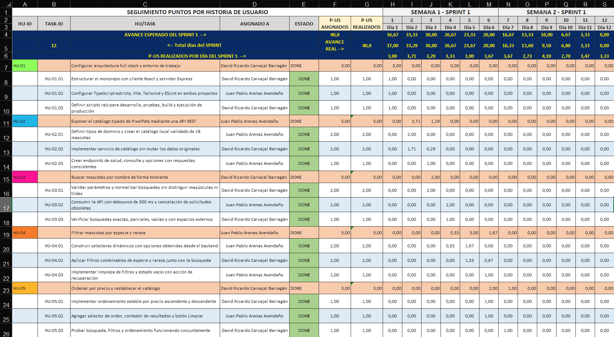
>
> 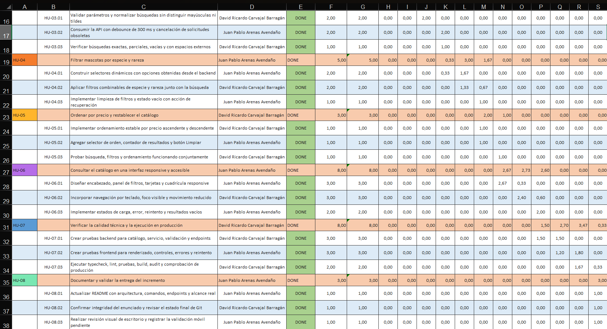
>
> Figura 3 y 4. Seguimiento del Sprint Backlog de PixelPets mediante puntos de historia.
> Fuente: elaboración propia.

> **EVIDENCIA SB-02 — Gráfica Burn Down de puntos**
>
> 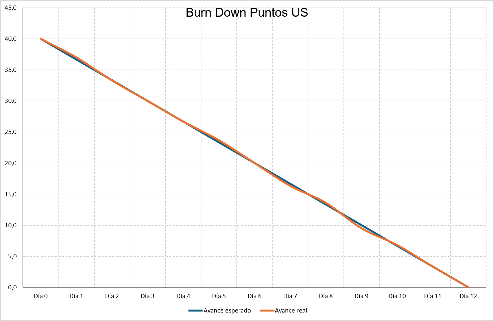
>
> 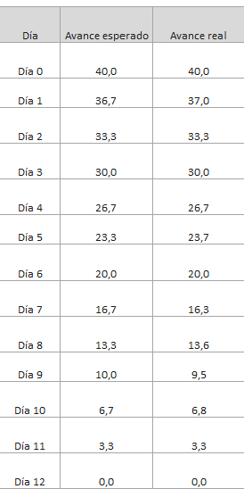
>
> Figura 5 y 6. Burn Down de puntos del Sprint 1; la trayectoria real se mantuvo cercana a la planeada y finalizó con cero puntos pendientes. Fuente: elaboración propia.

### Análisis del Burn Down de puntos

La gráfica es un Burn Down porque muestra trabajo restante decreciente. Comenzó en 40 puntos y terminó en cero: se completaron 40 puntos, equivalentes al 100 % del compromiso. El promedio planificado fue aproximadamente 3,33 puntos por día.

Las diferencias fueron pequeñas. Por ejemplo, el Día 1 quedaron 37,00 puntos frente a 36,67 esperados; el Día 9 el equipo se situó ligeramente por delante, con 9,50 frente a 10,00. Las desviaciones se compensaron antes del cierre y no comprometieron el Objetivo del Sprint. La velocidad observada fue 40 puntos, pero un único Sprint no permite generalizar una velocidad futura confiable.

## Sprint Backlog — Seguimiento por horas

### Identificación, asignación y horas

| HU-ID | TASK-ID  | HU/TASK                                                                             | Responsable                      | Estado | Tiempo proyectado | Horas invertidas |
| ----- | -------- | ----------------------------------------------------------------------------------- | -------------------------------- | ------ | ----------------: | ---------------: |
| HU-01 |          | Configurar arquitectura full stack y entorno de trabajo                             | David Ricardo Carvajal Barragán | DONE   |                 9 |                8 |
|       | HU-01.01 | Estructurar el monorepo con cliente React y servidor Express                        | David Ricardo Carvajal Barragán | DONE   |                 3 |                3 |
|       | HU-01.02 | Configurar TypeScript estricto, Vite, Tailwind y ESLint en ambos proyectos          | Juan Pablo Arenas Avendaño      | DONE   |                 3 |                3 |
|       | HU-01.03 | Definir scripts raíz para desarrollo, pruebas, build y ejecución de producción   | David Ricardo Carvajal Barragán | DONE   |                 3 |                2 |
| HU-02 |          | Exponer el catálogo tipado de PixelPets mediante una API REST                      | Juan Pablo Arenas Avendaño      | DONE   |                15 |               16 |
|       | HU-02.01 | Definir tipos de dominio y crear el catálogo local validado de 18 mascotas         | Juan Pablo Arenas Avendaño      | DONE   |                 6 |                6 |
|       | HU-02.02 | Implementar servicio de catálogo sin mutar los datos originales                    | David Ricardo Carvajal Barragán | DONE   |                 6 |                7 |
|       | HU-02.03 | Crear endpoints de salud, consulta y opciones con respuestas consistentes           | Juan Pablo Arenas Avendaño      | DONE   |                 3 |                3 |
| HU-03 |          | Buscar mascotas por nombre de forma tolerante                                       | David Ricardo Carvajal Barragán | DONE   |                15 |               16 |
|       | HU-03.01 | Validar parámetros y normalizar búsquedas sin distinguir mayúsculas ni tildes    | David Ricardo Carvajal Barragán | DONE   |                 6 |                6 |
|       | HU-03.02 | Consumir la API con debounce de 300 ms y cancelación de solicitudes obsoletas      | Juan Pablo Arenas Avendaño      | DONE   |                 6 |                7 |
|       | HU-03.03 | Verificar búsquedas exactas, parciales, vacías y con espacios externos            | David Ricardo Carvajal Barragán | DONE   |                 3 |                3 |
| HU-04 |          | Filtrar mascotas por especie y rareza                                               | Juan Pablo Arenas Avendaño      | DONE   |                15 |               14 |
|       | HU-04.01 | Construir selectores dinámicos con opciones obtenidas desde el backend             | Juan Pablo Arenas Avendaño      | DONE   |                 6 |                6 |
|       | HU-04.02 | Aplicar filtros combinables de especie y rareza junto con la búsqueda              | David Ricardo Carvajal Barragán | DONE   |                 6 |                6 |
|       | HU-04.03 | Implementar limpieza de filtros y estado vacío con acción de recuperación        | Juan Pablo Arenas Avendaño      | DONE   |                 3 |                2 |
| HU-05 |          | Ordenar por precio y restablecer el catálogo                                       | David Ricardo Carvajal Barragán | DONE   |                 9 |                9 |
|       | HU-05.01 | Implementar ordenamiento estable por precio ascendente y descendente                | David Ricardo Carvajal Barragán | DONE   |                 3 |                3 |
|       | HU-05.02 | Agregar selector de orden, contador de resultados y botón Limpiar                  | Juan Pablo Arenas Avendaño      | DONE   |                 3 |                3 |
|       | HU-05.03 | Probar búsqueda, filtros y ordenamiento funcionando conjuntamente                  | David Ricardo Carvajal Barragán | DONE   |                 3 |                3 |
| HU-06 |          | Consultar el catálogo en una interfaz responsive y accesible                       | Juan Pablo Arenas Avendaño      | DONE   |                24 |               25 |
|       | HU-06.01 | Diseñar encabezado, panel de filtros, tarjetas y cuadrícula responsive            | Juan Pablo Arenas Avendaño      | DONE   |                 9 |                9 |
|       | HU-06.02 | Incorporar navegación por teclado, foco visible y movimiento reducido              | David Ricardo Carvajal Barragán | DONE   |                 9 |               10 |
|       | HU-06.03 | Implementar estados de carga, error, reintento y resultados vacíos                 | Juan Pablo Arenas Avendaño      | DONE   |                 6 |                6 |
| HU-07 |          | Verificar la calidad técnica y la ejecución en producción                        | David Ricardo Carvajal Barragán | DONE   |                24 |               24 |
|       | HU-07.01 | Crear pruebas backend para catálogo, servicio, validación y endpoints             | David Ricardo Carvajal Barragán | DONE   |                 9 |                8 |
|       | HU-07.02 | Crear pruebas frontend para renderizado, controles, errores y reintento             | Juan Pablo Arenas Avendaño      | DONE   |                 9 |               10 |
|       | HU-07.03 | Ejecutar typecheck, lint, pruebas, build, audit y comprobación de producción      | David Ricardo Carvajal Barragán | DONE   |                 6 |                6 |
| HU-08 |          | Documentar y validar la entrega del incremento                                      | Juan Pablo Arenas Avendaño      | DONE   |                 9 |                8 |
|       | HU-08.01 | Actualizar README con arquitectura, comandos, endpoints y alcance real              | Juan Pablo Arenas Avendaño      | DONE   |                 3 |                3 |
|       | HU-08.02 | Confirmar integridad del enunciado y revisar el estado final de Git                 | David Ricardo Carvajal Barragán | DONE   |                 3 |                3 |
|       | HU-08.03 | Realizar revisión visual de escritorio y registrar la validación móvil pendiente | Juan Pablo Arenas Avendaño      | DONE   |                 3 |                2 |

Los totales por historia consolidan las tareas. Las variaciones de `-1`, `0` o `+1` hora se compensaron entre historias hasta conservar 120 horas globales.

### Seguimiento diario de horas — Día 1 a Día 6

| Elemento | Día 1 | Día 2 | Día 3 | Día 4 | Día 5 | Día 6 |
| -------- | -----: | -----: | -----: | -----: | -----: | -----: |
| HU-01    |      8 |      0 |      0 |      0 |      0 |      0 |
| HU-01.01 |      3 |      0 |      0 |      0 |      0 |      0 |
| HU-01.02 |      3 |      0 |      0 |      0 |      0 |      0 |
| HU-01.03 |      2 |      0 |      0 |      0 |      0 |      0 |
| HU-02    |      0 |     12 |      4 |      0 |      0 |      0 |
| HU-02.01 |      0 |      6 |      0 |      0 |      0 |      0 |
| HU-02.02 |      0 |      6 |      1 |      0 |      0 |      0 |
| HU-02.03 |      0 |      0 |      3 |      0 |      0 |      0 |
| HU-03    |      0 |      0 |      6 |     10 |      0 |      0 |
| HU-03.01 |      0 |      0 |      6 |      0 |      0 |      0 |
| HU-03.02 |      0 |      0 |      0 |      7 |      0 |      0 |
| HU-03.03 |      0 |      0 |      0 |      3 |      0 |      0 |
| HU-04    |      0 |      0 |      0 |      1 |      9 |      4 |
| HU-04.01 |      0 |      0 |      0 |      1 |      5 |      0 |
| HU-04.02 |      0 |      0 |      0 |      0 |      4 |      2 |
| HU-04.03 |      0 |      0 |      0 |      0 |      0 |      2 |
| HU-05    |      0 |      0 |      0 |      0 |      0 |      6 |
| HU-05.01 |      0 |      0 |      0 |      0 |      0 |      3 |
| HU-05.02 |      0 |      0 |      0 |      0 |      0 |      3 |
| HU-05.03 |      0 |      0 |      0 |      0 |      0 |      0 |
| HU-06    |      0 |      0 |      0 |      0 |      0 |      0 |
| HU-06.01 |      0 |      0 |      0 |      0 |      0 |      0 |
| HU-06.02 |      0 |      0 |      0 |      0 |      0 |      0 |
| HU-06.03 |      0 |      0 |      0 |      0 |      0 |      0 |
| HU-07    |      0 |      0 |      0 |      0 |      0 |      0 |
| HU-07.01 |      0 |      0 |      0 |      0 |      0 |      0 |
| HU-07.02 |      0 |      0 |      0 |      0 |      0 |      0 |
| HU-07.03 |      0 |      0 |      0 |      0 |      0 |      0 |
| HU-08    |      0 |      0 |      0 |      0 |      0 |      0 |
| HU-08.01 |      0 |      0 |      0 |      0 |      0 |      0 |
| HU-08.02 |      0 |      0 |      0 |      0 |      0 |      0 |
| HU-08.03 |      0 |      0 |      0 |      0 |      0 |      0 |

### Seguimiento diario de horas — Día 7 a Día 12

| Elemento | Día 7 | Día 8 | Día 9 | Día 10 | Día 11 | Día 12 |
| -------- | -----: | -----: | -----: | ------: | ------: | ------: |
| HU-01    |      0 |      0 |      0 |       0 |       0 |       0 |
| HU-01.01 |      0 |      0 |      0 |       0 |       0 |       0 |
| HU-01.02 |      0 |      0 |      0 |       0 |       0 |       0 |
| HU-01.03 |      0 |      0 |      0 |       0 |       0 |       0 |
| HU-02    |      0 |      0 |      0 |       0 |       0 |       0 |
| HU-02.01 |      0 |      0 |      0 |       0 |       0 |       0 |
| HU-02.02 |      0 |      0 |      0 |       0 |       0 |       0 |
| HU-02.03 |      0 |      0 |      0 |       0 |       0 |       0 |
| HU-03    |      0 |      0 |      0 |       0 |       0 |       0 |
| HU-03.01 |      0 |      0 |      0 |       0 |       0 |       0 |
| HU-03.02 |      0 |      0 |      0 |       0 |       0 |       0 |
| HU-03.03 |      0 |      0 |      0 |       0 |       0 |       0 |
| HU-04    |      0 |      0 |      0 |       0 |       0 |       0 |
| HU-04.01 |      0 |      0 |      0 |       0 |       0 |       0 |
| HU-04.02 |      0 |      0 |      0 |       0 |       0 |       0 |
| HU-04.03 |      0 |      0 |      0 |       0 |       0 |       0 |
| HU-05    |      3 |      0 |      0 |       0 |       0 |       0 |
| HU-05.01 |      0 |      0 |      0 |       0 |       0 |       0 |
| HU-05.02 |      0 |      0 |      0 |       0 |       0 |       0 |
| HU-05.03 |      3 |      0 |      0 |       0 |       0 |       0 |
| HU-06    |      8 |      9 |      8 |       0 |       0 |       0 |
| HU-06.01 |      8 |      1 |      0 |       0 |       0 |       0 |
| HU-06.02 |      0 |      8 |      2 |       0 |       0 |       0 |
| HU-06.03 |      0 |      0 |      6 |       0 |       0 |       0 |
| HU-07    |      0 |      0 |      4 |       8 |      11 |       1 |
| HU-07.01 |      0 |      0 |      4 |       4 |       0 |       0 |
| HU-07.02 |      0 |      0 |      0 |       4 |       6 |       0 |
| HU-07.03 |      0 |      0 |      0 |       0 |       5 |       1 |
| HU-08    |      0 |      0 |      0 |       0 |       0 |       8 |
| HU-08.01 |      0 |      0 |      0 |       0 |       0 |       3 |
| HU-08.02 |      0 |      0 |      0 |       0 |       0 |       3 |
| HU-08.03 |      0 |      0 |      0 |       0 |       0 |       2 |

### Resumen del Burn Down de horas

| Día | Tiempo esperado restante | Tiempo real restante | Horas invertidas en el día |
| ---: | -----------------------: | -------------------: | --------------------------: |
|    0 |                      120 |                  120 |                           0 |
|    1 |                      110 |                  112 |                           8 |
|    2 |                      100 |                  100 |                          12 |
|    3 |                       90 |                   90 |                          10 |
|    4 |                       80 |                   79 |                          11 |
|    5 |                       70 |                   70 |                           9 |
|    6 |                       60 |                   60 |                          10 |
|    7 |                       50 |                   49 |                          11 |
|    8 |                       40 |                   40 |                           9 |
|    9 |                       30 |                   28 |                          12 |
|   10 |                       20 |                   20 |                           8 |
|   11 |                       10 |                    9 |                          11 |
|   12 |                        0 |                    0 |                           9 |

> **EVIDENCIA ST-01 — Sprint Backlog completo por horas**
>
> 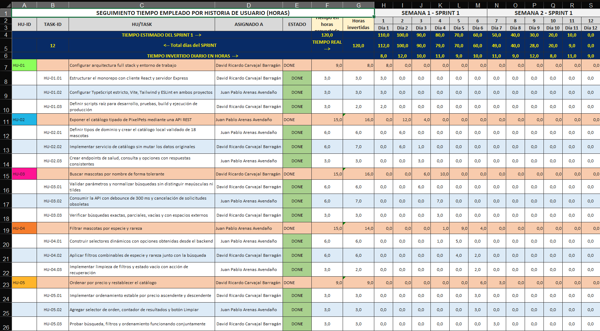
>
> 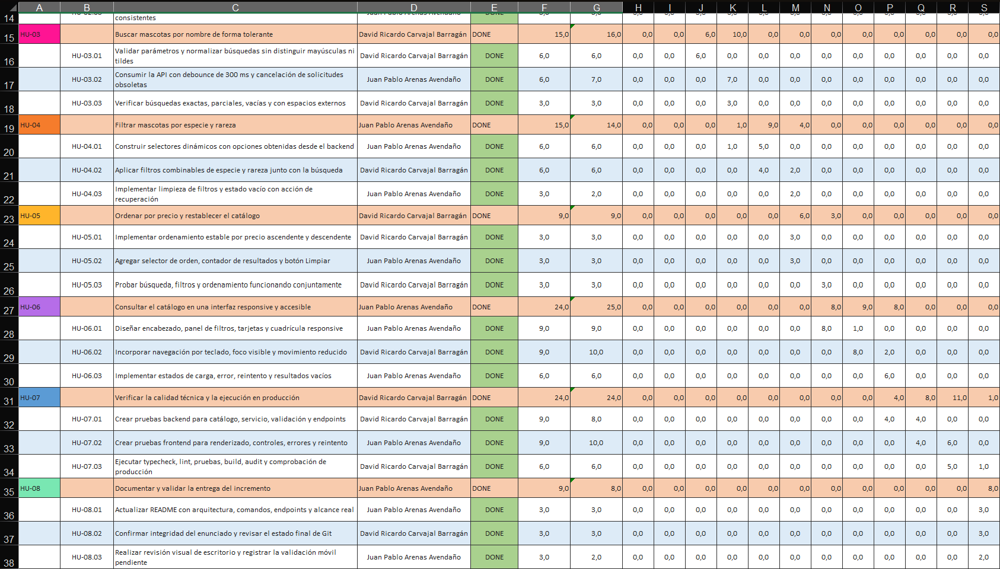
>
> Figura 7 y 8. Seguimiento del esfuerzo simulado del Sprint 1 mediante horas por historia y tarea.
> Fuente: elaboración propia.

> **EVIDENCIA ST-02 — Gráfica Burn Down de horas**
>
> 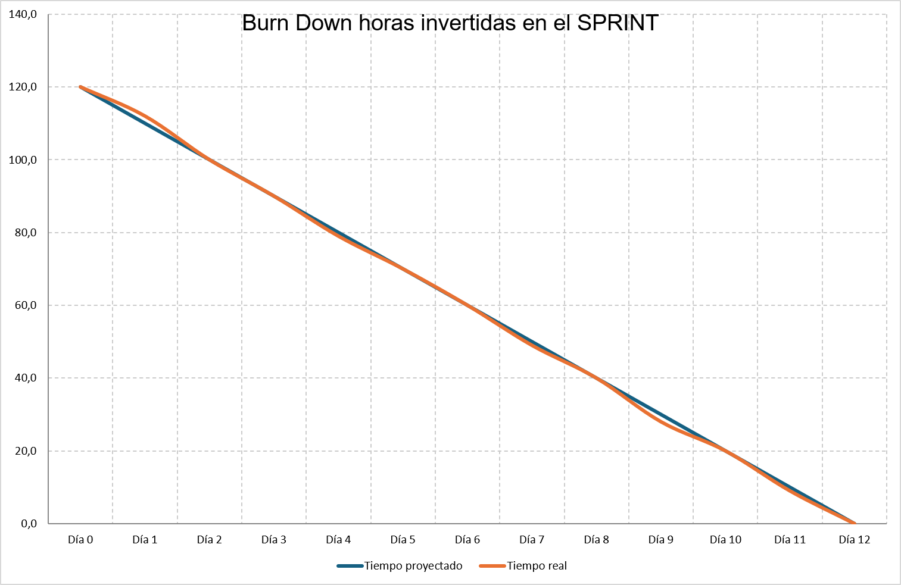
>
> 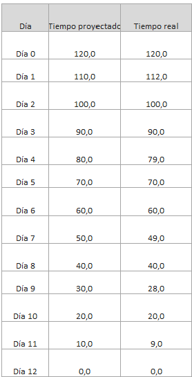
>
> Figura 9 y 10. Burn Down de horas del Sprint 1; el esfuerzo real presentó pequeñas variaciones diarias y cerró con cero horas pendientes. Fuente: elaboración propia.

### Análisis del Burn Down de horas

Esta gráfica también es Burn Down: compara tiempo restante proyectado y real. Se proyectaron y registraron 120 horas, con cero pendientes al final y 100 % de cumplimiento global. Las variaciones se compensaron dentro del Sprint: HU-01, HU-04 y HU-08 usaron una hora menos; HU-02, HU-03 y HU-06 emplearon una hora más; HU-05 y HU-07 coincidieron con su proyección.

Las horas modelan seguimiento temporal simulado, mientras que los puntos expresan esfuerzo relativo. Por eso no se convierten entre sí ni se interpreta que un punto equivalga a tres horas, aunque ambas series terminen simultáneamente.

## Distribución individual y tabla de notas

### Asignación de las 24 tareas

| Tarea    | Asignado a                       | Puntos asignados | Puntos realizados |
| -------- | -------------------------------- | ---------------: | ----------------: |
| HU-01.01 | David Ricardo Carvajal Barragán |                1 |                 1 |
| HU-01.02 | Juan Pablo Arenas Avendaño      |                1 |                 1 |
| HU-01.03 | David Ricardo Carvajal Barragán |                1 |                 1 |
| HU-02.01 | Juan Pablo Arenas Avendaño      |                2 |                 2 |
| HU-02.02 | David Ricardo Carvajal Barragán |                2 |                 2 |
| HU-02.03 | Juan Pablo Arenas Avendaño      |                1 |                 1 |
| HU-03.01 | David Ricardo Carvajal Barragán |                2 |                 2 |
| HU-03.02 | Juan Pablo Arenas Avendaño      |                2 |                 2 |
| HU-03.03 | David Ricardo Carvajal Barragán |                1 |                 1 |
| HU-04.01 | Juan Pablo Arenas Avendaño      |                2 |                 2 |
| HU-04.02 | David Ricardo Carvajal Barragán |                2 |                 2 |
| HU-04.03 | Juan Pablo Arenas Avendaño      |                1 |                 1 |
| HU-05.01 | David Ricardo Carvajal Barragán |                1 |                 1 |
| HU-05.02 | Juan Pablo Arenas Avendaño      |                1 |                 1 |
| HU-05.03 | David Ricardo Carvajal Barragán |                1 |                 1 |
| HU-06.01 | Juan Pablo Arenas Avendaño      |                3 |                 3 |
| HU-06.02 | David Ricardo Carvajal Barragán |                3 |                 3 |
| HU-06.03 | Juan Pablo Arenas Avendaño      |                2 |                 2 |
| HU-07.01 | David Ricardo Carvajal Barragán |                3 |                 3 |
| HU-07.02 | Juan Pablo Arenas Avendaño      |                3 |                 3 |
| HU-07.03 | David Ricardo Carvajal Barragán |                2 |                 2 |
| HU-08.01 | Juan Pablo Arenas Avendaño      |                1 |                 1 |
| HU-08.02 | David Ricardo Carvajal Barragán |                1 |                 1 |
| HU-08.03 | Juan Pablo Arenas Avendaño      |                1 |                 1 |

### Resumen individual

| Estudiante                       | Puntos asignados | Puntos realizados | Cumplimiento | Nota |
| -------------------------------- | ---------------: | ----------------: | -----------: | ---: |
| David Ricardo Carvajal Barragán |               20 |                20 |        100 % | 5,00 |
| Juan Pablo Arenas Avendaño      |               20 |                20 |        100 % | 5,00 |
| Total                            |               40 |                40 |        100 % |   — |

El promedio de puntos asignados fue 20. Para cada integrante, el porcentaje basado en el promedio fue 100 % y la nota basada en el promedio fue 5,00. El rendimiento individual también fue 100 %, con nota individual 5,00.

> **EVIDENCIA TN-01 — Tabla de notas**
>
> 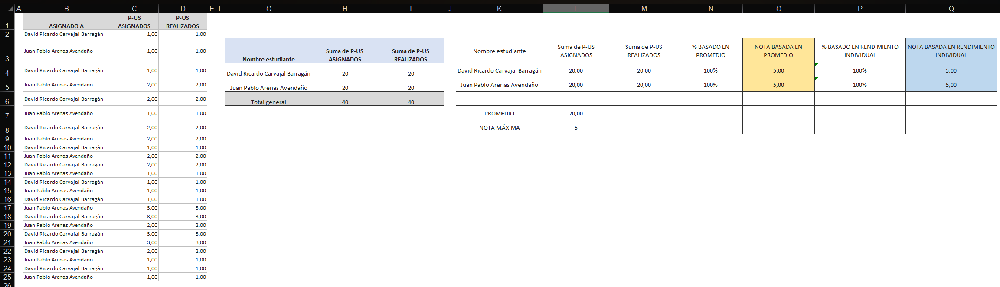
>
> **Pie de figura sugerido:** Figura 11. Distribución equilibrada de puntos y resultado individual de los integrantes del proyecto PixelPets. Fuente: elaboración propia.

Ambos recibieron y completaron 20 puntos. La distribución fue equilibrada y ambos participaron en todas las etapas; la responsabilidad principal de una tarea identifica liderazgo de ejecución, no trabajo aislado.

## Seguimiento mediante Daily Scrum

La Daily Scrum se utilizó para inspeccionar el progreso hacia el Objetivo del Sprint y adaptar el plan de trabajo, no para rendir un informe a una autoridad [1]. Los siguientes eventos son una reconstrucción académica coherente con las distribuciones diarias de los Excel.

### Daily Scrum — Día 1

- **Trabajo completado:** arquitectura full stack, monorepo, TypeScript estricto, Vite, Tailwind, ESLint y scripts raíz.
- **Trabajo planeado:** definir el dominio, crear el catálogo y comenzar el servicio.
- **Impedimentos:** coordinar scripts compatibles con ambos workspaces.
- **Decisiones o ajustes:** centralizar los comandos en el `package.json` raíz.
- **Puntos completados:** 3,00.
- **Puntos restantes:** 37,00.
- **Horas registradas:** 8.
- **Horas restantes:** 112.
- **Evidencia relacionada:** HU-01.01, HU-01.02 y HU-01.03; archivos de configuración raíz, cliente y servidor.

### Daily Scrum — Día 2

- **Trabajo completado:** tipos de dominio, catálogo de 18 mascotas y primera parte del servicio sin mutaciones.
- **Trabajo planeado:** terminar el servicio, exponer endpoints e iniciar la búsqueda.
- **Impedimentos:** asegurar variedad y validez del catálogo sin duplicar identificadores.
- **Decisiones o ajustes:** validar el catálogo completo al cargarlo con el esquema Zod.
- **Puntos completados:** 3,71.
- **Puntos restantes:** 33,29.
- **Horas registradas:** 12.
- **Horas restantes:** 100.
- **Evidencia relacionada:** HU-02.01 y avance de HU-02.02; `domain/pet.ts` y `data/pets.ts`.

### Daily Scrum — Día 3

- **Trabajo completado:** finalización del catálogo, servicio inicial, endpoints y normalización inicial de búsquedas.
- **Trabajo planeado:** completar búsqueda tolerante e integrar debounce y cancelación.
- **Impedimentos:** tratar de la misma forma mayúsculas, espacios y nombres con tildes.
- **Decisiones o ajustes:** normalizar con NFD, retirar diacríticos y comparar en minúsculas.
- **Puntos completados:** 3,29.
- **Puntos restantes:** 30,00.
- **Horas registradas:** 10.
- **Horas restantes:** 90.
- **Evidencia relacionada:** cierre de HU-02 y avance de HU-03.01; `petController.ts` y `petService.ts`.

### Daily Scrum — Día 4

- **Trabajo completado:** debounce de 300 ms, cancelación de solicitudes obsoletas, pruebas de búsqueda e inicio de selectores.
- **Trabajo planeado:** obtener opciones desde el backend y completar filtros por especie y rareza.
- **Impedimentos:** evitar que una respuesta antigua reemplazara resultados recientes.
- **Decisiones o ajustes:** crear un `AbortController` por efecto y cancelarlo durante la limpieza.
- **Puntos completados:** 3,33.
- **Puntos restantes:** 26,67.
- **Horas registradas:** 11.
- **Horas restantes:** 79.
- **Evidencia relacionada:** cierre de HU-03 y avance de HU-04.01; `usePets.ts` y pruebas de búsqueda.

### Daily Scrum — Día 5

- **Trabajo completado:** selectores dinámicos y filtros por especie y rareza.
- **Trabajo planeado:** combinar filtros, búsqueda, limpieza y comenzar ordenamiento.
- **Impedimentos:** mantener sincronizadas las listas del panel con el backend.
- **Decisiones o ajustes:** obtener especies, rarezas y opciones de orden desde `/api/pets/options`.
- **Puntos completados:** 3,00.
- **Puntos restantes:** 23,67.
- **Horas registradas:** 9.
- **Horas restantes:** 70.
- **Evidencia relacionada:** HU-04.01 y avance de HU-04.02; `FilterPanel.tsx` y `getPetOptions`.

### Daily Scrum — Día 6

- **Trabajo completado:** filtros combinados, limpieza, estado vacío y ordenamiento inicial.
- **Trabajo planeado:** probar la combinación completa e iniciar la interfaz responsive.
- **Impedimentos:** mantener estable el ordenamiento con precios repetidos.
- **Decisiones o ajustes:** conservar el índice original como criterio de desempate.
- **Puntos completados:** 3,67.
- **Puntos restantes:** 20,00.
- **Horas registradas:** 10.
- **Horas restantes:** 60.
- **Evidencia relacionada:** cierre de HU-04, HU-05.01 y HU-05.02; `filterPets` y `EmptyState.tsx`.

### Daily Scrum — Día 7

- **Trabajo completado:** prueba integral de ordenamiento y primer bloque de encabezado, panel, tarjetas y cuadrícula.
- **Trabajo planeado:** continuar diseño responsive y accesibilidad.
- **Impedimentos:** distribuir los controles sin desplazamiento horizontal en anchos reducidos.
- **Decisiones o ajustes:** usar cuadrículas adaptables y abreviar elementos del encabezado por debajo de 400 px.
- **Puntos completados:** 3,67.
- **Puntos restantes:** 16,33.
- **Horas registradas:** 11.
- **Horas restantes:** 49.
- **Evidencia relacionada:** cierre de HU-05 e inicio de HU-06.01; `PetGrid.tsx`, `Header.tsx` y `FilterPanel.tsx`.

### Daily Scrum — Día 8

- **Trabajo completado:** diseño responsive, etiquetas, foco visible, navegación por teclado y movimiento reducido.
- **Trabajo planeado:** terminar estados de interfaz y comenzar pruebas backend.
- **Impedimentos:** mejorar accesibilidad sin perder legibilidad ni identidad visual.
- **Decisiones o ajustes:** ocultar iconos decorativos a lectores, usar controles nativos y definir `prefers-reduced-motion`.
- **Puntos completados:** 2,73.
- **Puntos restantes:** 13,60.
- **Horas registradas:** 9.
- **Horas restantes:** 40.
- **Evidencia relacionada:** cierre de HU-06.01 y avance de HU-06.02; componentes e `index.css`.

### Daily Scrum — Día 9

- **Trabajo completado:** accesibilidad restante, estados de carga, error, reintento y vacío; inicio de pruebas backend.
- **Trabajo planeado:** ampliar pruebas del servicio y comenzar pruebas de la interfaz.
- **Impedimentos:** cubrir respuestas inválidas y resultados vacíos sin tratarlos como error interno.
- **Decisiones o ajustes:** responder `400` solo a parámetros inválidos y `200` con `data: []` a consultas sin coincidencias.
- **Puntos completados:** 4,10.
- **Puntos restantes:** 9,50.
- **Horas registradas:** 12.
- **Horas restantes:** 28.
- **Evidencia relacionada:** cierre de HU-06 e inicio de HU-07.01; `app.test.ts`, `pets.test.ts` y `petService.test.ts`.

### Daily Scrum — Día 10

- **Trabajo completado:** pruebas backend y primer grupo de pruebas frontend.
- **Trabajo planeado:** completar pruebas de controles, ejecutar verificaciones estáticas y compilar.
- **Impedimentos:** simular la API en frontend sin depender de Internet.
- **Decisiones o ajustes:** reemplazar el servicio HTTP con mocks controlados y usar User Event para interacciones.
- **Puntos completados:** 2,70.
- **Puntos restantes:** 6,80.
- **Horas registradas:** 8.
- **Horas restantes:** 20.
- **Evidencia relacionada:** avance de HU-07.01 y HU-07.02; cuatro archivos de prueba.

### Daily Scrum — Día 11

- **Trabajo completado:** pruebas frontend, typecheck, lint, build y primeras validaciones de producción.
- **Trabajo planeado:** cerrar verificación de producción, README, Git e inspección visual.
- **Impedimentos:** asegurar que Express sirviera el build de React y conservara el prefijo `/api`.
- **Decisiones o ajustes:** activar `NODE_ENV=production` con `cross-env` y usar fallback hacia `index.html`.
- **Puntos completados:** 3,47.
- **Puntos restantes:** 3,33.
- **Horas registradas:** 11.
- **Horas restantes:** 9.
- **Evidencia relacionada:** avance de HU-07.02 y HU-07.03; scripts, build y `server/src/app.ts`.

### Daily Scrum — Día 12

- **Trabajo completado:** cierre técnico, README, integridad de Git, revisión visual de escritorio y validación del Incremento.
- **Trabajo planeado:** insertar posteriormente las evidencias reales, enlaces, release y despliegue cuando existan.
- **Impedimentos:** el navegador headless de Windows impuso un ancho mínimo que no constituyó evidencia móvil confiable.
- **Decisiones o ajustes:** registrar la captura móvil como pendiente, sin inventarla, y reforzar reglas para 320 px.
- **Puntos completados:** 3,33.
- **Puntos restantes:** 0,00.
- **Horas registradas:** 9.
- **Horas restantes:** 0.
- **Evidencia relacionada:** cierre de HU-07 y HU-08; README, estado de Git, comprobaciones HTTP e inspección visual.

## Arquitectura de la solución

PixelPets utiliza un monorepo full stack. En el frontend se emplean React, Vite, TypeScript estricto, Tailwind CSS, Lucide React, Vitest y React Testing Library. React permite dividir la interfaz en componentes y componer una pantalla a partir de piezas reutilizables [3]. Vite proporciona el servidor de desarrollo y el build del cliente [6].

En el backend se utilizan Node.js, Express, TypeScript, Zod, Vitest y Supertest. Express organiza los endpoints mediante rutas y manejadores modulares [4]; Zod valida en tiempo de ejecución los datos y parámetros que TypeScript no puede verificar una vez recibidos por HTTP [7].


### Almacenamiento

El catálogo local tipado está en el backend y no existe base de datos. El caso solo exige consulta y no incluye CRUD, autenticación ni persistencia. Esta decisión reduce complejidad innecesaria para un Sprint académico, mantiene separación full stack y evita duplicar los datos en el frontend.

## Estructura del proyecto

```text
PixelPets/
├── client/
│   ├── src/
│   │   ├── components/
│   │   ├── hooks/
│   │   ├── services/
│   │   ├── test/
│   │   ├── types/
│   │   ├── App.tsx
│   │   ├── App.test.tsx
│   │   ├── index.css
│   │   └── main.tsx
│   ├── package.json
│   ├── tsconfig.json
│   └── vite.config.ts
├── server/
│   ├── src/
│   │   ├── controllers/
│   │   ├── data/
│   │   ├── domain/
│   │   ├── middleware/
│   │   ├── routes/
│   │   ├── schemas/
│   │   ├── services/
│   │   ├── app.ts
│   │   ├── app.test.ts
│   │   └── server.ts
│   ├── package.json
│   └── tsconfig.json
├── Product_Backlog_PixelPets.xlsx
├── Sprint_1_Backlog_PixelPets.xlsx
├── package.json
├── README.md
└── pivote-2026-20.md
```

- `components` contiene las piezas visuales y los estados de interfaz.
- `hooks` coordina filtros, carga, errores, debounce y cancelación.
- `services` centraliza la comunicación HTTP.
- `types` define el contrato usado por el cliente.
- `domain` define tipos y validación de mascotas en el servidor.
- `data` contiene el único catálogo.
- `schemas` valida parámetros de consulta.
- `services` aplica búsqueda, filtros y ordenamiento.
- `controllers` forma respuestas HTTP.
- `routes` declara los endpoints del catálogo.
- `middleware` unifica errores y respuestas no encontradas.

No se muestran `node_modules`, `dist`, archivos de caché ni rutas personales porque no forman parte de la estructura fuente relevante.

## Flujo funcional de PixelPets

1. El usuario abre PixelPets.
2. React inicializa la interfaz.
3. El frontend consulta `/api/pets/options`.
4. El frontend consulta `/api/pets`.
5. El backend valida los parámetros con Zod.
6. El servicio crea objetos auxiliares a partir del catálogo sin alterar el arreglo original.
7. Aplica búsqueda normalizada.
8. Aplica filtros de especie y rareza.
9. Aplica ordenamiento si fue solicitado.
10. Devuelve `data` y `meta`.
11. React muestra el resultado correspondiente.
12. Un cambio de control genera una nueva consulta.
13. El debounce evita solicitudes excesivas.
14. `AbortController` cancela solicitudes obsoletas.
15. Limpiar restablece controles y catálogo.

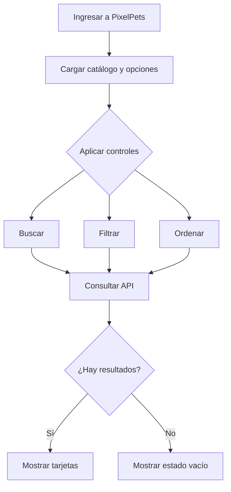

## Endpoints

| Método | Endpoint              | Propósito                                           |
| ------- | --------------------- | ---------------------------------------------------- |
| GET     | `/api/health`       | Comprobar el estado del servicio                     |
| GET     | `/api/pets`         | Consultar, buscar, filtrar y ordenar mascotas        |
| GET     | `/api/pets/options` | Obtener especies, rarezas y opciones de ordenamiento |

`GET /api/pets` acepta los parámetros opcionales `search`, `species`, `rarity` y `sort`. Los valores permitidos para orden son `price-asc` y `price-desc`.

```http
GET /api/pets
GET /api/pets?search=luna
GET /api/pets?species=Robot
GET /api/pets?rarity=Legendario
GET /api/pets?sort=price-asc
GET /api/pets?search=luna&species=Gato%20Cósmico&rarity=Raro&sort=price-desc
```

Los parámetros inválidos generan `400`. Una combinación sin coincidencias genera `200` con `data: []`. Los errores tienen código y mensaje consistentes, y el middleware no expone trazas internas al cliente.

## Fragmentos de código representativos

### Modelo tipado de una mascota

Archivo: `server/src/domain/pet.ts`

```ts
export interface Pet {
  id: string;
  name: string;
  species: PetSpecies;
  rarity: PetRarity;
  price: number;
  health: number;
  description: string;
}
```

Este contrato refleja los seis datos obligatorios y añade una descripción breve. TypeScript comprueba el uso estático del modelo en compilación [5].

### Esquema Zod de consulta

Archivo: `server/src/schemas/petQuerySchema.ts`

```ts
export const petQuerySchema = z
  .object({
    search: z.string().max(80).optional().default(""),
    species: z.union([z.enum(PET_SPECIES), z.literal("")]).optional(),
    rarity: z.union([z.enum(PET_RARITIES), z.literal("")]).optional(),
    sort: z.union([z.enum(PET_SORT_OPTIONS), z.literal("")]).optional(),
  })
  .strict()
  .transform((query) => ({
    search: query.search.trim(),
    species: query.species ?? "",
    rarity: query.rarity ?? "",
    sort: query.sort ?? "",
  }));
```

El esquema rechaza parámetros desconocidos o valores fuera de las listas permitidas y normaliza las ausencias.

### Normalización y filtrado

Archivo: `server/src/services/petService.ts`

```ts
export function normalizeText(value: string): string {
  return value
    .normalize("NFD")
    .replace(/\p{Diacritic}/gu, "")
    .toLocaleLowerCase("es");
}

export function filterPets(
  filters: PetFilters,
  catalog: readonly Pet[] = pets,
): Pet[] {
  const normalizedSearch = normalizeText(filters.search.trim());

  const matches = catalog
    .map((pet, originalIndex) => ({ pet, originalIndex }))
    .filter(({ pet }) => {
      const matchesSearch =
        normalizedSearch === "" ||
        normalizeText(pet.name).includes(normalizedSearch);
      const matchesSpecies =
        filters.species === "" || pet.species === filters.species;
      const matchesRarity =
        filters.rarity === "" || pet.rarity === filters.rarity;
```

El fragmento muestra la tolerancia a tildes y capitalización, así como la aplicación independiente y combinable de filtros.

### Rutas de mascotas

Archivo: `server/src/routes/petRoutes.ts`

```ts
import { Router } from "express";
import { getPetOptions, getPets } from "../controllers/petController.js";

export const petRouter = Router();

petRouter.get("/options", getPetOptions);
petRouter.get("/", getPets);
```

El router mantiene separada la declaración de rutas de la construcción de respuestas.

### Solicitud del frontend

Archivo: `client/src/services/petApi.ts`

```ts
export async function fetchPets(
  filters: PetFilters,
  signal?: AbortSignal,
): Promise<PetResponse> {
  const parameters = new URLSearchParams();

  if (filters.search.trim() !== "") parameters.set("search", filters.search.trim());
  if (filters.species !== "") parameters.set("species", filters.species);
  if (filters.rarity !== "") parameters.set("rarity", filters.rarity);
  if (filters.sort !== "") parameters.set("sort", filters.sort);

  const query = parameters.toString();
  const response = await fetch(
    `/api/pets${query === "" ? "" : `?${query}`}`,
    signal === undefined ? undefined : { signal },
  );

  return readResponse<PetResponse>(response);
}
```

El cliente construye parámetros solo cuando tienen valor, usa una ruta relativa y acepta la señal de cancelación.

### Ejemplo de prueba automatizada

Archivo: `server/src/services/petService.test.ts`

```ts
it("tolera búsquedas sin tildes", () => {
  expect(filterPets({ ...noFilters, search: "orbita" })[0]?.name).toBe("Órbita");
});

it("no modifica el catálogo original", () => {
  const originalOrder = pets.map(({ id }) => id);
  filterPets({ ...noFilters, sort: "price-desc" });
  expect(pets.map(({ id }) => id)).toEqual(originalOrder);
});
```

Vitest ejecuta casos rápidos y aislados para la lógica de negocio [8].

### Scripts principales

Archivo: `package.json`

```json
"scripts": {
  "dev": "concurrently -n API,WEB -c cyan,magenta \"npm run dev --workspace server\" \"npm run dev --workspace client\"",
  "typecheck": "npm run typecheck --workspaces --if-present",
  "lint": "npm run lint --workspaces --if-present",
  "test": "npm run test --workspaces --if-present",
  "build": "npm run build --workspace client && npm run build --workspace server",
  "start": "npm run start --workspace server"
}
```

Los scripts raíz hacen reproducibles desarrollo, análisis estático, pruebas, build y ejecución local de producción.

## Decisiones técnicas y académicas justificadas

| Decisión                        | Justificación                                                                                | Beneficio                                             | Evidencia                                        |
| -------------------------------- | --------------------------------------------------------------------------------------------- | ----------------------------------------------------- | ------------------------------------------------ |
| Arquitectura full stack          | El caso exige una aplicación funcional y el equipo debía demostrar integración de software | Separa presentación, HTTP y negocio                  | `client/`, `server/` y rutas `/api`        |
| Monorepo                         | Cliente y servidor pertenecen al mismo incremento académico                                  | Instalación y comandos únicos                       | Workspaces en`package.json`                    |
| React por componentes            | La interfaz contiene controles, tarjetas y estados con responsabilidades distintas            | Facilita comprensión, pruebas y mantenimiento [3]    | `client/src/components`                        |
| Express con rutas modulares      | La API tiene endpoints con controladores diferenciados                                        | Evita concentrar HTTP en un solo archivo [4]          | `routes`, `controllers`, `app.ts`          |
| TypeScript estricto              | Los contratos atraviesan filtros, respuestas y datos                                          | Detecta incompatibilidades antes de ejecutar [5]      | Ambos`tsconfig.json` y `typecheck`           |
| Catálogo solo en backend        | Una única fuente evita divergencias                                                          | El frontend siempre consulta datos reales             | `server/src/data/pets.ts`                      |
| Sin base de datos                | No existen CRUD, usuarios ni persistencia                                                     | Reduce riesgo y complejidad fuera del alcance         | Catálogo local tipado                           |
| Zod para validación             | HTTP entrega datos en tiempo de ejecución                                                    | Rechaza parámetros inválidos con`400` [7]         | `petQuerySchema.ts`                            |
| Opciones dinámicas desde API    | Las listas manuales podían desactualizarse                                                   | Sincroniza frontend y dominio                         | `/api/pets/options`                            |
| Debounce de 300 ms               | Cada pulsación podía causar una solicitud                                                   | Reduce tráfico sin introducir demora perceptible     | `usePets.ts`                                   |
| `AbortController`              | Una respuesta anterior podía llegar después de otra reciente                                | Evita condiciones de carrera                          | Efectos de`usePets`                            |
| Ordenamiento sin mutación       | El catálogo debe recuperar su orden original                                                 | Protege la fuente y hace reproducibles los resultados | `filterPets` y prueba de no mutación          |
| Desempate por índice original   | Existen precios repetidos                                                                     | Mantiene un orden estable                             | `originalIndex` en `petService.ts`           |
| Estados de carga, error y vacío | La red y las búsquedas no siempre producen tarjetas                                          | Mantiene informado al usuario y ofrece recuperación  | `LoadingState`, `ErrorState`, `EmptyState` |
| Accesibilidad mediante teclado   | No todos los usuarios operan con mouse                                                        | Controles nativos, etiquetas y foco visible           | Componentes y`App.tsx`                         |
| Diseño responsive               | El enunciado incluye computador, tableta y celular                                            | Reorganiza controles y cuadrícula [10]               | Clases responsive e`index.css`                 |
| Pruebas backend y frontend       | La lógica y la interfaz tienen riesgos distintos                                             | 24 pruebas de servidor y 14 de cliente                | Cuatro archivos de pruebas                       |
| Build servido por Express        | Producción local debe usar un único servidor                                                | Conserva`/api` y ofrece fallback SPA                | Bloque de producción en`app.ts`               |
| Ausencia de servicios externos   | La entrega debe ser reproducible sin credenciales ni Internet                                 | Reduce fallos y exposición de secretos               | Catálogo y representaciones locales             |
| Un solo Sprint                   | El tiempo de clase y el alcance forman un MVP integrado                                       | Evita una división artificial del ciclo simulado     | Excel y Objetivo del Sprint                      |
| Estimación Fibonacci            | Los puntos expresan tamaño relativo e incertidumbre                                          | Distingue historias simples de trabajo transversal    | Valores 1, 2, 3, 5 y 8                           |

## Matriz de trazabilidad

| Requisito                          | Historia | Implementación                                                   | Prueba                                                        | Estado |
| ---------------------------------- | -------- | ----------------------------------------------------------------- | ------------------------------------------------------------- | ------ |
| Catálogo de 18 mascotas           | HU-02    | `server/src/data/pets.ts`                                       | `pets.test.ts`, `app.test.ts`                             | Done   |
| Búsqueda por nombre               | HU-03    | `normalizeText`, `filterPets`, `usePets`                    | Casos exacto y parcial en`petService.test.ts`               | Done   |
| Búsqueda sin mayúsculas o tildes | HU-03    | `normalizeText`                                                 | Casos`nOvA` y `orbita`                                    | Done   |
| Filtro por especie                 | HU-04    | `filterPets`, `FilterPanel`                                   | Filtro Robot e interacción de selector                       | Done   |
| Filtro por rareza                  | HU-04    | `filterPets`, `FilterPanel`                                   | Filtro Épico e interacción Legendario                       | Done   |
| Filtros combinados                 | HU-04    | Condiciones conjuntas de`filterPets`                            | Gato Cósmico + Común                                        | Done   |
| Orden ascendente                   | HU-05    | Comparador con dirección`1`                                    | Secuencia ascendente y empate estable                         | Done   |
| Orden descendente                  | HU-05    | Comparador con dirección`-1`                                   | Secuencia descendente                                         | Done   |
| Limpiar controles                  | HU-05    | `clearFilters`, botones Limpiar y estado vacío                 | Interacción en`App.test.tsx`                               | Done   |
| Responsive                         | HU-06    | cuadrículas y breakpoints Tailwind                               | Revisión visual de escritorio; móvil pendiente de evidencia | Done   |
| Accesibilidad                      | HU-06    | etiquetas, enlace de salto, foco, ARIA y reducción de movimiento | Consultas por rol y nombre accesible                          | Done   |
| Carga, error y vacío              | HU-06    | componentes de estado en`App.tsx`                               | Estados vacío/error y reintento                              | Done   |
| Pruebas backend                    | HU-07    | Vitest y Supertest                                                | 24 aprobadas                                                  | Done   |
| Pruebas frontend                   | HU-07    | Testing Library y User Event [9]                                  | 14 aprobadas                                                  | Done   |
| Build de producción               | HU-07    | Vite,`tsc` y Express estático                                  | `npm run build` y comprobación HTTP                        | Done   |
| README e integridad                | HU-08    | `README.md` y revisión del prefijo                             | `git diff --check` y SHA-256                                | Done   |

## Pruebas y calidad

Las verificaciones técnicas se realizaron durante la etapa de implementación y se registraron con resultados reales:

| Verificación        | Resultado          |
| -------------------- | ------------------ |
| Typecheck            | Aprobado           |
| Lint                 | Aprobado           |
| Errores de lint      | 0                  |
| Advertencias de lint | 0                  |
| Pruebas totales      | 38                 |
| Pruebas frontend     | 14                 |
| Pruebas backend      | 24                 |
| Pruebas fallidas     | 0                  |
| Build frontend       | Aprobado           |
| Build backend        | Aprobado           |
| `npm audit`        | 0 vulnerabilidades |
| `git diff --check` | Aprobado           |
| `npm start`        | Comprobado         |

También se verificó que `/api/health` respondiera correctamente, que una búsqueda combinada devolviera el resultado esperado, que Express sirviera el frontend y que el fallback SPA respondiera correctamente. La inspección visual de escritorio fue satisfactoria. El código incluye ajustes para 320 px; la evidencia final en un teléfono real o modo dispositivo permanece pendiente.

### Comandos reproducibles

```bash
npm install
npm run dev
npm run typecheck
npm run lint
npm run test
npm run build
npm start
```

## Evidencias funcionales pendientes

Los siguientes espacios deben completarse con capturas reales:

> **EVIDENCIA APP-01 — Vista inicial**
>
> 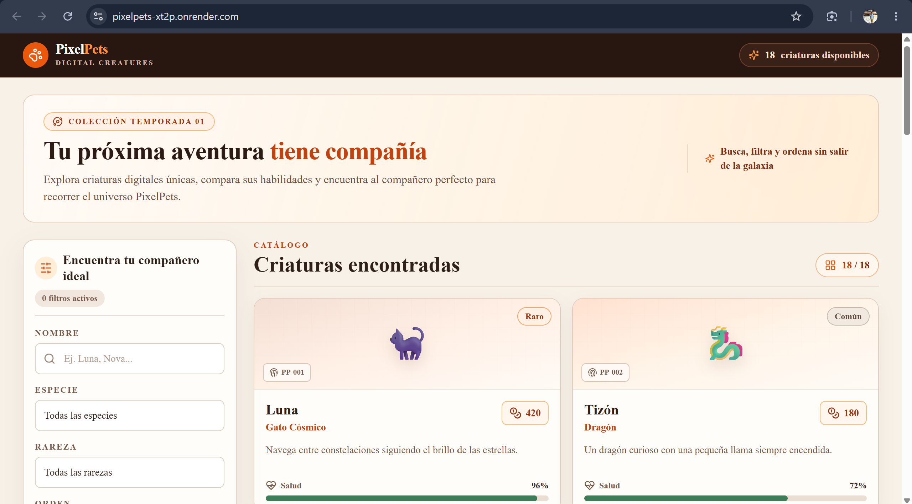
>
> Figura 12. Vista inicial de PixelPets con las 18 mascotas disponibles. Fuente: elaboración propia.

> **EVIDENCIA APP-02 — Búsqueda**
>
> 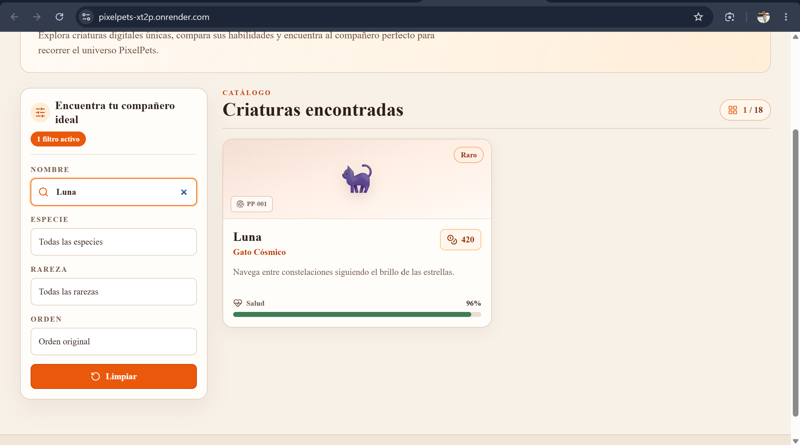
>
> Figura 13. Búsqueda parcial de mascotas por nombre sin recargar la aplicación. Fuente: elaboración propia.

> **EVIDENCIA APP-03 — Filtros combinados**
>
> 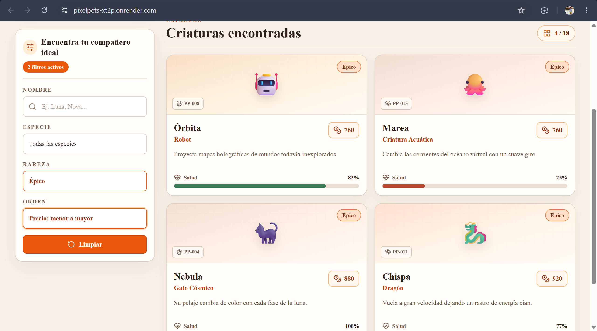
>
> Figura 14 Aplicación combinada de los filtros por especie y rareza. Fuente: elaboración propia.

> **EVIDENCIA APP-04 — Ordenamiento**
>
> 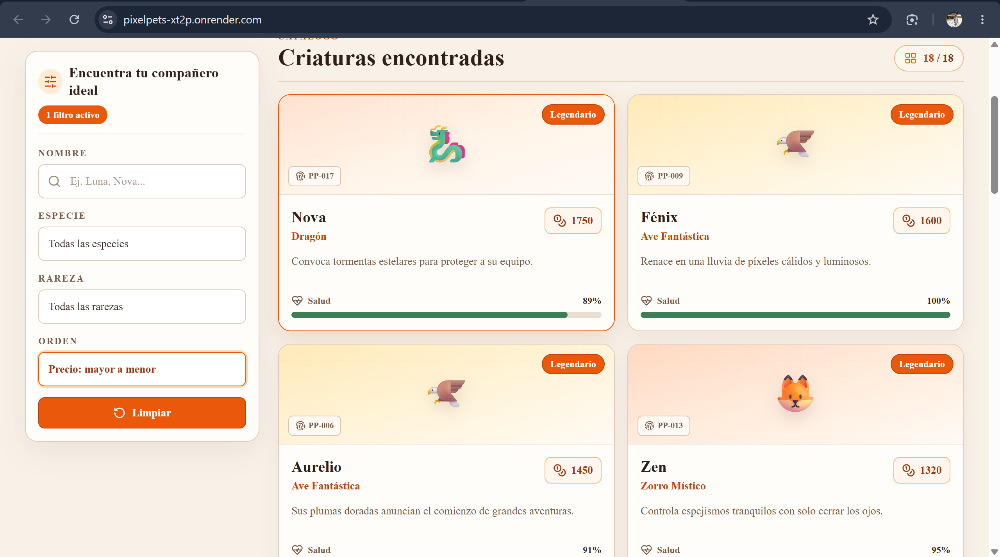
>
> Figura 15. Catálogo ordenado por precio mediante los controles de PixelPets. Fuente: elaboración propia.

> **EVIDENCIA APP-05 — Diseño responsive**
>
> 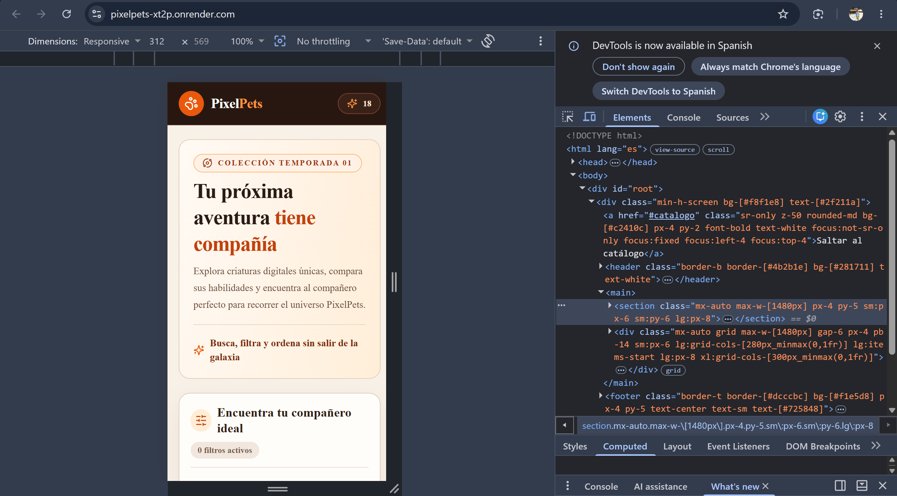
>
> 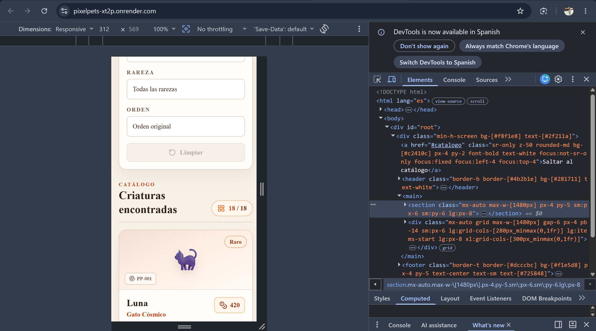Figura 16 y 17. Adaptación responsive de PixelPets para dispositivos móviles. Fuente: elaboración propia.

## Sprint Review

### Objetivo

La Sprint Review simulada tuvo como propósito inspeccionar el resultado del Sprint y compararlo con el Objetivo del Producto y los criterios de aceptación. Fue una validación académica interna de los dos integrantes, no una aceptación contractual de un cliente externo.

### Incremento presentado

Se presentó la aplicación full stack disponible localmente: catálogo de 18 mascotas servido por API REST, búsqueda tolerante, filtros dinámicos y combinables, ordenamiento estable, contador, limpieza, tarjetas responsive y estados de carga, error y vacío.

### Funcionalidades demostradas

1. Carga inicial de 18 mascotas.
2. Búsqueda exacta, parcial, sin distinguir mayúsculas ni tildes.
3. Filtros de especie y rareza, separados y combinados.
4. Orden de precio ascendente y descendente.
5. Limpieza de controles.
6. Ausencia de resultados y recuperación.
7. Respuesta de salud y validación de parámetros.
8. Build servido por Express.

### Resultados y aceptación

Los criterios se contrastaron con el código, las pruebas y las verificaciones. Las 38 pruebas aprobaron; TypeScript, ESLint y build finalizaron correctamente; `npm audit` informó cero vulnerabilidades. Todas las historias alcanzaron `Done`.

| Resultado           |    Valor |
| ------------------- | -------: |
| Historias aceptadas |   8 de 8 |
| Tareas completadas  | 24 de 24 |
| Puntos aceptados    | 40 de 40 |
| Pruebas aprobadas   | 38 de 38 |

### Observaciones y resultado final

El Incremento cumple el caso práctico y está disponible localmente. Las capturas, los enlaces de GitHub, la publicación de una Release y el despliegue no forman parte del Incremento actual y permanecen como actividades posteriores.

```text
8 de 8 historias aceptadas
24 de 24 tareas completadas
40 de 40 puntos aceptados
Incremento funcional disponible localmente
```

## Sprint Retrospective

La Sprint Retrospective simulada se orientó a identificar cambios concretos para aumentar calidad y efectividad, propósito establecido por la Guía Scrum [1].

### Mantener

- Comunicación constante.
- División clara de responsabilidades.
- Pruebas tempranas.
- Código tipado.
- Integración frecuente.
- Seguimiento diario.

### Mejorar

- Validar antes en dispositivo móvil.
- Distribuir mejor la documentación durante el Sprint.
- Preparar las capturas al completar cada historia.
- Evitar concentrar validaciones en los últimos días.

### Dejar de hacer

- Posponer evidencias visuales.
- Depender de verificaciones manuales tardías.
- Agrupar demasiadas actividades de cierre en el Día 12.

### Acciones concretas

- Agregar validación móvil temprana.
- Registrar evidencias por historia.
- Actualizar documentación diariamente.
- Mantener una lista de comprobación de Definition of Done.

No se identificaron conflictos personales; las mejoras se concentran en el proceso y la anticipación de evidencias.

## Métricas finales

| Métrica                  | Resultado |
| ------------------------- | --------: |
| Historias planificadas    |         8 |
| Historias completadas     |         8 |
| Cumplimiento de historias |     100 % |
| Tareas planificadas       |        24 |
| Tareas completadas        |        24 |
| Cumplimiento de tareas    |     100 % |
| Puntos planificados       |        40 |
| Puntos completados        |        40 |
| Cumplimiento de puntos    |     100 % |
| Horas proyectadas         |       120 |
| Horas registradas         |       120 |
| Puntos de David           |        20 |
| Puntos de Juan Pablo      |        20 |
| Pruebas automatizadas     |        38 |
| Pruebas fallidas          |         0 |
| Mascotas del catálogo    |        18 |
| Endpoints principales     |         3 |
| Sprints                   |         1 |
| Duración simulada        |  12 días |

La velocidad observada fue 40 puntos en este Sprint. Al existir una sola observación, no es estadísticamente responsable utilizarla como predicción confiable de velocidad futura.

## Estado del repositorio y despliegue

```text
Rama base: main
Rama de trabajo: feature/pixelpets-aplicacion-completa
Merge con main: no realizado
Push: no realizado
Pull Request: no creado
Despliegue: pendiente
GitHub Release: pendiente
```

La implementación y la documentación permanecen sin commit en la rama de trabajo. No se atribuyeron cambios a identidades distintas de la configuración existente. No se configuró integración continua ni despliegue.

## Enlaces del proyecto

- **Repositorio de GitHub:** PENDIENTE_DE_AGREGAR
- **Aplicación desplegada:** PENDIENTE_DE_AGREGAR
- **Release MVP v1.0:** PENDIENTE_DE_PUBLICAR

`MVP v1.0` es la release planificada en el Product Backlog; todavía no representa una publicación en GitHub.

## Conclusiones

El ciclo Scrum simulado permitió organizar el caso práctico como un objetivo de producto, un Sprint integrado y un Incremento verificable. El Product Backlog transformó el problema en ocho historias priorizadas y el Sprint Backlog las descompuso en 24 tareas con responsables, puntos y seguimiento temporal.

Las Daily Scrum hicieron visibles las diferencias pequeñas frente al plan y permitieron documentar ajustes como opciones dinámicas, cancelación de solicitudes y ordenamiento estable. Los dos Burn Down mostraron trabajo restante, no trabajo acumulado: ambos partieron del compromiso total y cerraron en cero.

Las pruebas automatizadas, TypeScript, ESLint, el build y las comprobaciones HTTP respaldan la calidad declarada. La arquitectura mantuvo el catálogo en el backend, evitó complejidad transaccional innecesaria y cumplió las capacidades de consulta, búsqueda, filtrado y ordenamiento exigidas.

El alcance fue adecuado para el tiempo académico: la aplicación contiene un MVP full stack completo sin inventar autenticación, compras o persistencia. Quedan pendientes la inserción de las 15 evidencias visuales, los enlaces definitivos, la publicación de una GitHub Release y el despliegue.

## Referencias

[1] Schwaber, K. y Sutherland, J. (2020). *La Guía de Scrum: La Guía Definitiva de Scrum*. Traducción latinoamericana. [https://scrumguides.org/docs/scrumguide/v2020/2020-Scrum-Guide-Spanish-Latin-South-American.pdf](https://scrumguides.org/docs/scrumguide/v2020/2020-Scrum-Guide-Spanish-Latin-South-American.pdf)

[2] MDN Web Docs. *Cómo escribir en Markdown*. [https://developer.mozilla.org/es/docs/MDN/Writing_guidelines/Howto/Markdown_in_MDN](https://developer.mozilla.org/es/docs/MDN/Writing_guidelines/Howto/Markdown_in_MDN)

[3] React. *Quick Start*. [https://react.dev/learn](https://react.dev/learn)

[4] Express. *Routing*. [https://expressjs.com/en/5x/guide/routing/](https://expressjs.com/en/5x/guide/routing/)

[5] TypeScript. *Documentation*. [https://www.typescriptlang.org/docs/](https://www.typescriptlang.org/docs/)

[6] Vite. *Getting Started*. [https://vite.dev/guide/](https://vite.dev/guide/)

[7] Zod. *Introduction*. [https://zod.dev/](https://zod.dev/)

[8] Vitest. *Getting Started*. [https://vitest.dev/guide/](https://vitest.dev/guide/)

[9] Testing Library. *React Testing Library: Introduction*. [https://testing-library.com/docs/react-testing-library/intro/](https://testing-library.com/docs/react-testing-library/intro/)

[10] Tailwind CSS. *Responsive design*. [https://tailwindcss.com/docs/responsive-design](https://tailwindcss.com/docs/responsive-design)

## Resultado final y enlaces de acceso

Al 30 de julio de 2026, PixelPets quedó finalizado, integrado en la rama `main` y desplegado correctamente en Render. La aplicación funciona públicamente y puede utilizarse desde cualquier navegador, sin necesidad de ejecutarla en un entorno local. El código fuente también está disponible en el repositorio público de GitHub.

* **Aplicación desplegada:** [PixelPets en Render](https://pixelpets-xt2p.onrender.com)
* **Repositorio público:** [Richard117297/Pivote_2026_20](https://github.com/Richard117297/Pivote_2026_20)

El despliegue final permite acceder al frontend y consumir la API REST desde una misma URL pública, completando satisfactoriamente el desarrollo, la integración continua y la publicación del MVP.
